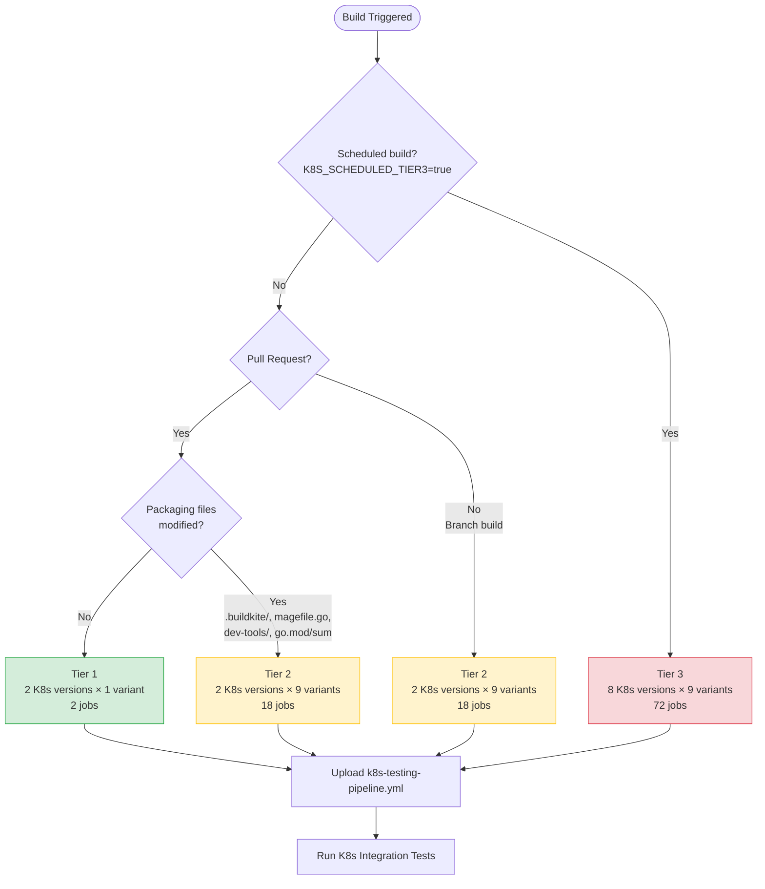

# Kubernetes Testing Tiers

Kubernetes integration tests are organized into three tiers to optimize CI resources.

## Decision Flow

## Tier Definitions

| Tier | K8s Versions | Container Images | When Used | Job Count |
|------|--------------|------------------|-----------|-----------|
| **Tier 1** | Min + Max (2) | Basic only (1) | PRs (default) | 2 |
| **Tier 2** | Min + Max (2) | All (9) | Branch builds, packaging PRs | 18 |
| **Tier 3** | All (8) | All (9) | Scheduled (daily) | 72 |

## Triggers

- **PRs**: Tier 1 by default, Tier 2 if packaging files modified
- **Branches**: Tier 2 on every commit
- **Scheduled**: Tier 3 daily at 2:00 AM UTC

### Packaging Files

PRs trigger Tier 2 when modifying:
- `.buildkite/**`
- `magefile.go`
- `dev-tools/**`
- `go.mod` / `go.sum`

## Implementation

1. **[.buildkite/scripts/upload-k8s-tests.sh](.buildkite/scripts/upload-k8s-tests.sh)** - Determines tier and uploads pipeline
2. **[.buildkite/k8s-testing-pipeline.yml](.buildkite/k8s-testing-pipeline.yml)** - Dynamic test pipeline template
3. **[.github/workflows/k8s-tier3-scheduled.yml](../.github/workflows/k8s-tier3-scheduled.yml)** - Scheduled Tier 3 trigger

## Updating K8s Versions

Update these variables in `.buildkite/scripts/upload-k8s-tests.sh`:
- `K8S_MIN_VERSION`
- `K8S_MAX_VERSION`
- `K8S_ALL_VERSIONS` (array)
