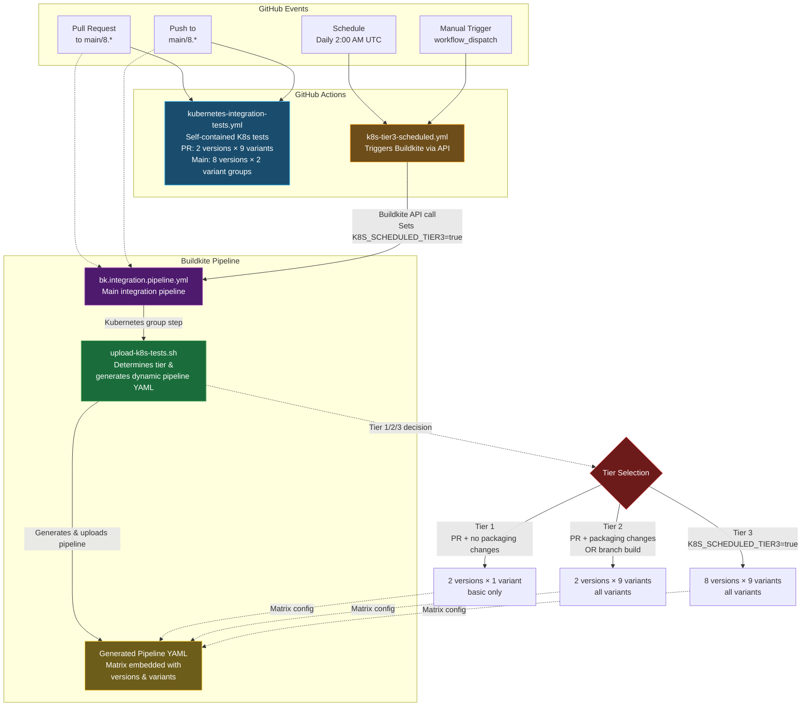

## How It Works

### GitHub Actions Path

**kubernetes-integration-tests.yml**
- Triggered on PR and push events to `main` and `8.*` branches
- Self-contained: packages containers, sets up ESS stack, runs tests
- Two different job strategies:
  - **PR builds**: `kubernetes-tests-pr` job
    - Matrix: 2 versions (v1.27.16, v1.34.0) × 9 variants individually
    - Creates 18 parallel jobs
    - Each job tests one version + one variant combination
  - **Non-PR builds**: `kubernetes-tests-main` job
    - Matrix: 8 versions × 2 variant groups
    - Variant groups: `basic,slim,complete,service,elastic-otel-collector` and `wolfi,slim-wolfi,complete-wolfi,elastic-otel-collector-wolfi`
    - Creates 16 parallel jobs
    - Each job tests one version with multiple variants (comma-separated in DOCKER_VARIANTS)

**k8s-tier3-scheduled.yml**
- Scheduled daily at 2:00 AM UTC or manually triggered via workflow_dispatch
- Triggers a Buildkite build via API call with environment variable `K8S_SCHEDULED_TIER3=true`
- Target: `elastic/elastic-agent` Buildkite pipeline

### Buildkite Path

**bk.integration.pipeline.yml**
- Main integration pipeline containing the Kubernetes group step
- The group depends on `integration-ess` (ESS stack) and `packaging-containers-amd64` (container artifacts)
- Contains a single step: `"Upload k8s tests pipeline"` which executes `upload-k8s-tests.sh`

**upload-k8s-tests.sh** (The Orchestrator)

This script is the heart of the dynamic pipeline generation. It:

1. **Determines the test tier** based on build context:
   - **Tier 1**: PR builds with no packaging file changes
     - Triggers when: PR + no changes to `.buildkite/`, `magefile.go`, `dev-tools/`, `go.mod`, `go.sum`
     - Config: 2 versions (min/max) × 1 variant (basic)
   
   - **Tier 2**: PR builds with packaging changes OR branch builds
     - Triggers when: PR + packaging file changes OR non-PR build
     - Config: 2 versions (min/max) × 9 variants (all)
   
   - **Tier 3**: Scheduled comprehensive tests
     - Triggers when: `K8S_SCHEDULED_TIER3=true` environment variable is set
     - Config: 8 versions (all) × 9 variants (all)

2. **Generates a complete pipeline YAML** with:
   - Common plugin definitions (google_oidc, oblt_cli, vault)
   - A single step template with `{{matrix.version}}` and `{{matrix.variant}}` placeholders
   - Embedded matrix configuration with the appropriate versions and variants arrays

3. **Uploads the generated pipeline** using `buildkite-agent pipeline upload`
   - Buildkite expands the matrix and creates individual jobs for each combination
   - Example: Tier 3 = 8 versions × 9 variants = 72 parallel jobs

### Key Design Points

1. **No static k8s-testing-pipeline.yml file**: The pipeline YAML is generated on-the-fly by `upload-k8s-tests.sh` based on the tier

2. **Packaging change detection**: The script checks if packaging-related files were modified in the PR to determine if Tier 2 testing is needed

3. **Matrix expansion**: Buildkite's native matrix feature expands the uploaded pipeline into individual jobs

4. **Artifact dependencies**: All jobs download the container artifacts from the `packaging-containers-amd64` step

5. **Version consistency**: K8s min/max versions are defined in both `upload-k8s-tests.sh` and the main integration pipeline for synchronization
