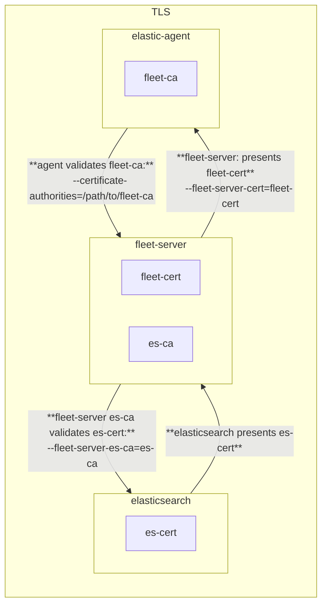
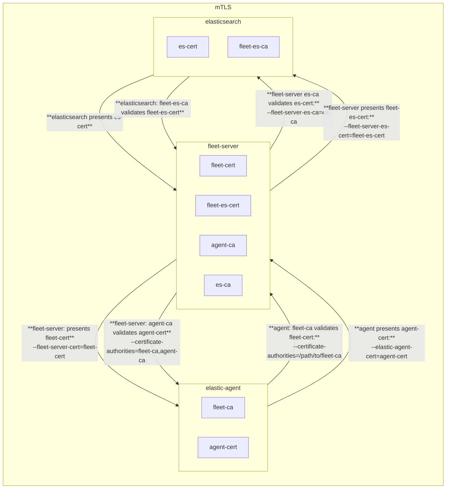

# TLS between Elastic AGent <-> Fleet Server <-> Elasticsearch

This shows the different certificates and certificate authorities used by the Elastic Agent, Fleet Server and Elasticsearch for the control plane communication and their respective cli flags when installing the Elastic Agent.

 - Elastic Agent (client) makes HTTPS requests to Fleet Server (server)
 - Fleet Server (client) makes HTTPS requests to Elasticsearch (server)

## TLS

For the TLS case, the following is used:
 - fleet-ca: the certificate authority for the certificate presented by Fleet Server
 - fleet-cert: the TLS certificate Fleet Server presents when a client makes an HTTPS request
 - fleet-cert-key: the private key for Fleet Server's TLS certificate (not shown in the diagram)
 - es-ca: the certificate authority for the certificate presented by Elasticsearch

```shell
elastic-agent install --url=https://your-fleet-server.elastic.co:443 \
--certificate-authorities=/path/to/fleet-ca \
--fleet-server-es=https://es.elastic.com:443 \
--fleet-server-es-ca=/path/to/es-ca \
--fleet-server-cert=/path/to/fleet-cert \
--fleet-server-cert-key=/path/to/fleet-cert-key \
--fleet-server-service-token=FLEET-SERVER-SERVICE-TOKEN \
--fleet-server-policy=FLEET-SERVER-POLICY-ID \
--fleet-server-port=8220
```


## mTLS

For the mTLS case, the following is used:
- agent-ca: the certificate authority for the certificate presented by the Elastic Agent
- agent-cert: the client TLS certificate Elastic Agent presents to Fleet Server
- agent-cert-key: the private key for the Elastic Agent's TLS certificate (not shown in the diagram)

- fleet-ca: the certificate authority for the certificate presented by Fleet Server
- fleet-cert: the TLS certificate Fleet Server presents when a client makes an HTTPS request
- fleet-cert-key: the private key for Fleet Server's TLS certificate (not shown in the diagram)

- fleet-es-ca: the certificate authority for the client TLS certificate presented by Fleet Server to Elasticsearch
- fleet-es-cert: the client TLS certificate Fleet Server presents to Elasticsearch
- fleet-es-cert-key: the private key for Fleet Server's client TLS certificate (not shown in the diagram)

- es-ca: the certificate authority for the certificate presented by Elasticsearch
- es-cert: the TLS certificate Elasticsearch presents when a client makes an HTTPS request

```shell
elastic-agent install --url=https://your-fleet-server.elastic.co:443 \
--certificate-authorities=/path/to/fleet-ca,/path/to/agent-ca \
--elastic-agent-cert=/path/to/agent-cert \
--elastic-agent-cert-key=/path/to/agent-cert-key \
--fleet-server-es=https://es.elastic.com:443 \
--fleet-server-es-ca=/path/to/es-ca \
--fleet-server-es-cert=/path/to/fleet-es-cert \
--fleet-server-es-cert-key=/path/to/fleet-es-cert-key \
--fleet-server-cert=/path/to/fleet-cert \
--fleet-server-cert-key=/path/to/fleet-cert-key \
--fleet-server-client-auth=required \
--fleet-server-service-token=FLEET-SERVER-SERVICE-TOKEN \
--fleet-server-policy=FLEET-SERVER-POLICY-ID \
--fleet-server-port=8220
```



