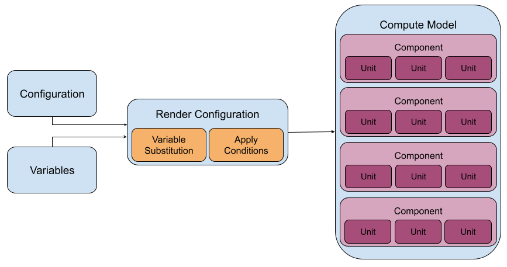
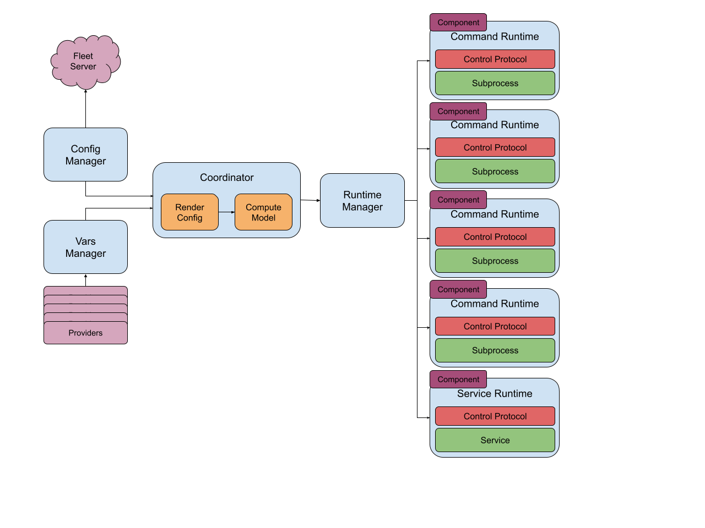

# Elastic Agent V2 Architecture

## Overview
The Elastic Agent V2 architecture was introduced in the 8.6 version of the Elastic Agent. It was a large internal change of how the Elastic Agent was designed and how it operated. The change was performed to allow better status reporting of each running input, enabled support for shippers, improved the specification definition, and allowed for better parallel change actions.
## Component Model
The entire logic of the Elastic Agent V2 architecture works with what is called the Component Model. The Elastic Agent uses policy to generate a Component Model and then that Component Model is used to ensure a consistency between the currently observed state and the expected state (which is the Component Model).
### Component
A component to Elastic Agent is anything that the Elastic Agent must run, operate, and observe during the life of the Elastic Agent. Component is a rather generic term for a good reason. A component can be multiple different types of running code that works with the Elastic Agent. The first example of this is the elastic-agent-shipper which is not an input. A component also always has units, see units below for description of a unit.
### Unit
A unit to Elastic Agent is a unique block of configuration that is passed to a component over the control protocol. The block of configuration only represents either one input or one output. It is possible for a component to be multiple units of inputs (aka. running multiple filestream inputs), or currently only one output, but designed to support the possibility of multiple outputs. Using multiple blocks of configuration into a set of units allows the Elastic Agent control protocol and the spawned component’s to communicate a unique set of changes as well as the status of each unit.

## Policy Stages
The policy of the Elastic Agent passes through different stages of rendering to result in the final configuration that gets sent to the runtime manager. Each stage mutates the configuration in its own way to make the required configuration for the components/units.
### AST Processing
The first stage of the process is to convert the YAML policy into an internal abstract syntax tree (AST) representation of the policy. The AST is used for the next two stages of the processing.
### Variable Substitution
After conversion of the policy into the AST the resulting AST is used to process the variables provided by the provider system inside the Elastic Agent. This substitutes any variables with values given by the providers or uses default variable values if the provider does not provide a value for the variable reference.
### Apply Conditions
The next stage of the policy's journey is to apply conditions. Applying conditions can result in parts of the policy being removed. This is used by many integrations to change the behavior based on variables that come from provides. (e.g. removing the winlog input on non-Windows hosts for the system integration).
### Compute Model
The final stage of the policy’s journey is to compute the components and units model that represents the expected state of the running Elastic Agent environment. Using the input specifications that each component defines in the Elastic Agent component directory, the Elastic Agent computes a model. That model can be different based on the platform that the Elastic Agent is running on because of specification settings defined in a component’s specification.

## Coordinator
The Elastic Agent Coordinator does as the name describes and it coordinates the process of taking policy and variables, computing the model, and passing that model off to the Runtime Manager. All actions that occur during the lifecycle of the Elastic Agent pass through the Coordinator. This allows the Coordinator to ensure that the action is performed by the correct piece of code in the Elastic Agent and the overall status of the Elastic Agent is managed from a central place (aka. Coordinator).

The architecture of the Coordinator is designed in a modular way. This modularity allows future changes to replace implementation without having to rewrite the entire operation of the Elastic Agent. A very simple example is a new Config Manager could be implemented and everything else stays the same.

## Config Manager
Currently the Elastic Agent has 3 Config Managers. The Config Manager role is to gather the configuration (based on its implementation) and pass that information to the Coordinator.
### Once Loader
The Once Loader loads the policy from the elastic-agent.yml file only once. So if the policy changes the Elastic Agent will not read the change in that file unless the Elastic Agent is restarted.
### Periodic Loader
The Periodic Loader loads the policy from the elastic-agent.yml file and monitors it for changes. If the file changes on disk then the updated policy is read and passed to the Coordinator.
### Managed Config Manager (Fleet)
The Managed Config Manager reads policy from the local action store on start up, then periodically communicates to the Fleet Server for new policy change actions to pass new policies to the Coordinator. This is the Config Manager used when the Elastic Agent is enrolled into Fleet.
### Fleet Server Bootstrap Manager (Fleet w/ Fleet Server)
This manager is responsible for bootstrapping a new Fleet Server when the Elastic Agent is started the first time and it is being enrolled with its own running Fleet Server. Internally it uses the Managed Config Manager, but it wraps the logic some to get the Fleet Server spawned before it can communicate with its own Fleet Server.
## Runtime Manager
After a configuration has been read, processed, and rendered into a Component Model it is finally passed into the Runtime Manager. The Runtime Manager’s goal is to take the current Component Model (which can change at anytime) and converge it with the currently observed Component Model. This results in the Runtime Manager starting or stopping different runtimes based on the provided Component Model.
### Component Runtime
A Component Runtime is assigned to each component that exists in the model, it is the role of the Component Runtime to manage that one component for the life of the Elastic Agent. It handles sending and receiving expected and observed configuration/state for that single component, as well as monitor the health of the resources that are required for that component to run.
### Command Runtime
The Command Runtime runs a component as a subprocess of the Elastic Agent. It monitors the spawned subprocess and ensures that it stays running and is healthy. In the case that it crashes the Elastic Agent will re-spawn the subprocess. This is the most used and the reference implementation for a Component Runtime.
### Service Runtime
The Service Runtime runs a component as an OS-level service on the host. It performs installation, upgrade, and uninstallation of the service as well as passing the expected and observed configuration to the running service. Currently only used by the Elastic Security Integration.
