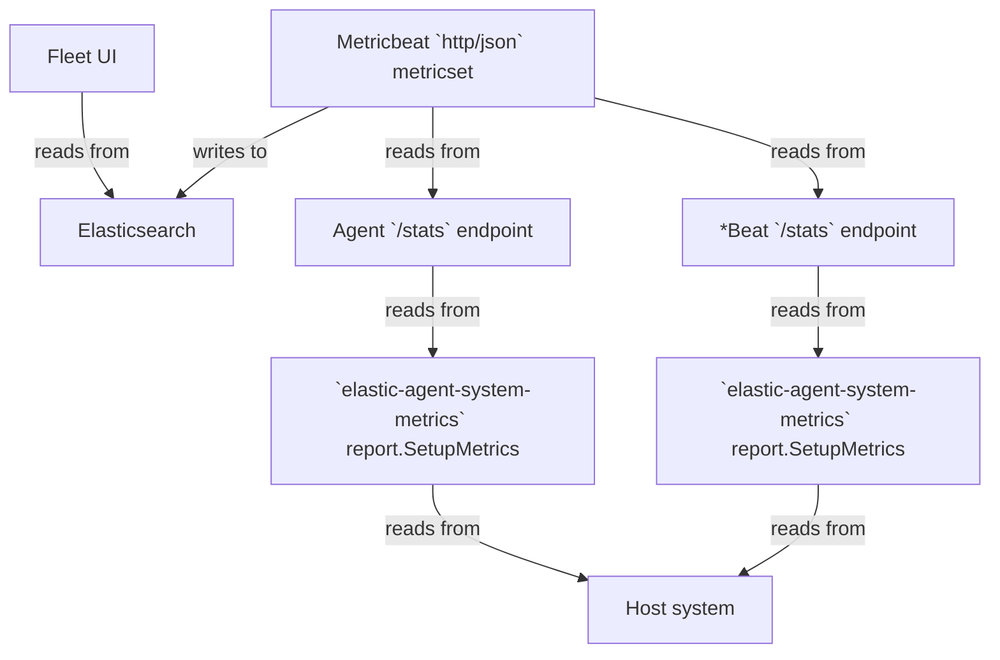

# How Agent CPU metrics in Fleet are calculated

## Data Flow



### Fleet UI reading from Elasticsearch

The Fleet UI code makes the following query to the `metrics-elastic_agent.*` indices in Elasticsearch.  Only CPU-related
aggregations are shown; memory-related aggregations are omitted.

```json
{
  "size": 0,
  "query": {
    "bool": {
      "must": [
        {
          "terms": {
            "_tier": [ "data_hot" ]
          }
        },
        {
          "range": {
            "@timestamp": {
              "gte": "now-5m"
            }
          }
        },
        {
          "terms": {
            "elastic_agent.id": [ agentIds ]
          }
        },
        {
          "bool": {
            "filter": [
              {
                "bool": {
                  "should": [
                    {
                      "term": {
                        "data_stream.dataset": "elastic_agent.elastic_agent"
                      }
                    }
                  ]
                }
              }
            ]
          }
        }
      ]
    }
  },
  "aggs": {
    "agents": {
      "terms": {
        "field": "elastic_agent.id",
        "size": 1000
      },
      "aggs": {
        "sum_cpu": {
          "sum_bucket": {
            "buckets_path": "processes>avg_cpu"
          }
        },
        "processes": {
          "terms": {
            "field": "elastic_agent.process",
            "size": 1000,
            "order": {
              "_count": "desc"
            }
          },
          "aggs": {
            "avg_cpu": {
              "avg_bucket": {
                "buckets_path": "cpu_time_series>cpu"
              }
            },
            "cpu_time_series": {
              "date_histogram": {
                "field": "@timestamp",
                "calendar_interval": "minute"
              },
              "aggs": {
                "max_cpu": {
                  "max": {
                    "field": "system.process.cpu.total.value"
                  }
                },
                "cpu_derivative": {
                  "derivative": {
                    "buckets_path": "max_cpu",
                    "gap_policy": "skip",
                    "unit": "10s"
                  }
                },
                "cpu": {
                  "bucket_script": {
                    "buckets_path": {
                      "cpu_total": "cpu_derivative[normalized_value]"
                    },
                    "script": {
                      "source": "if (params.cpu_total > 0) { return params.cpu_total / params._interval }",
                      "lang": "painless",
                      "params": {
                        "_interval": 10000
                      }
                    },
                    "gap_policy": "skip"
                  }
                }
              }
            }
          }
        }
      }
    }
  }
}
```


### Agent and Beats collect CPU metrics using `elastic-agent-system-metrics`

At startup, both Agent and Beats call the [`SetupMetrics` function](https://github.com/elastic/elastic-agent-system-metrics/blob/085e4529f3c4f91dd377cadbbe7a2bf321989438/report/setup.go#L49)
from the `github.com/elastic/elastic-agent-system-metrics/report` package.  This function registers a function with the
monitoring registry. Whenever this function is called, it calculates and reports CPU and other metrics for the process in
question.  The calculation of CPU (and other) metrics depends on the OS the Agent or Beat process is running on.

#### Collecting CPU usage metrics on Linux

On Linux, CPU usage metrics are collected by [reading the `/proc/$PID/stat` file](https://github.com/elastic/elastic-agent-system-metrics/blob/085e4529f3c4f91dd377cadbbe7a2bf321989438/metric/system/process/process_linux_common.go#L351).
This file contains whitespace-delimited values (fields) for various process metrics and other information. The field at
index 13 (0-based indexing) is the number of CPU ticks utilized by the process in user-space since it was started. The
field at index 14 is the number of CPU ticks utilized by the process in kernel-space since it was started.  As such, both
fields contain counter metrics. Both fields show the total number of CPU ticks consumed by the process across all available
cores (as opposed to showing normalized, per-core, values; [proof](https://gist.github.com/ycombinator/d55d884ec979fb86360a00b57f807de3)).

We want to convert these tick values into milliseconds so it becomes easier to figure out what percentage of CPU was
utilized by the process over a given period of time.  For example, if the process utilized 120 milliseconds of CPU time
over a period of 5 minutes, that would be a CPU utilization of 120 / (5 * 60 * 1000) = 0.0004 = 0.04%.

On a typical Linux host, there are 100 ticks per second. The actual value can be checked by running `getconf CLK_TCK`.
Therefore, if a process utilized T ticks, say in user-space, we can say that the process utilized (T / 100) seconds of
CPU time == (T / 100) * 1000 milliseconds of CPU time. We do this [conversion](https://github.com/elastic/elastic-agent-system-metrics/blob/085e4529f3c4f91dd377cadbbe7a2bf321989438/metric/system/process/process_linux_common.go#L374-L375)
from ticks to milliseconds for both user-space and kernel-space CPU utilization.

Finally, we [sum up](https://github.com/elastic/elastic-agent-system-metrics/blob/085e4529f3c4f91dd377cadbbe7a2bf321989438/metric/system/process/process_linux_common.go#L376)
the user-space and kernel-space CPU utilization (which is now in milliseconds) to arrive at the total CPU utilization.

##### Comparison between metrics in `top` output and in `/proc/$PID/stat` file

The `%CPU` reported for a process in `top` or `htop` output is in the range `[0, n*100]`, where `n` is the number of cores
available on the machine. For example, if a process runs two threads on a two-core machine, with each thread utilizing
about 60% of each core, `top` or `htop` will report `%CPU` as `120.0` (or close to it).

Applying the calculations from the previous section to corresponding values in the process's `/proc/{pid}/stat` file,
the results match up with what `top` or `htop` report.

### Metricbeat collects CPU metrics for Agent and the Beats it manages

There is one input in particular in the Agent policy that ultimately generates the data for the above ES query made by
the Fleet UI. This input is of type `http/metrics`, use the `monitoring` output, and has `id` = `metrics-monitoring-agent`.
A Metricbeat process is spawned for this input.

There are multiple inputs in the Metricbeat configuration that generate the data for the ES query.
* One input is for generating data for the Agent itself. This input will have `namespace` = `agent` and
  `id` = `metrics-monitoring-agent`.
* The remaining inputs will generate data for the various Beats managed by Agent. The number of inputs depends on the
  number of Beats. These inputs will have `namespace` = `agent` and `id` = `metrics-monitoring-*beat-$n`, where `$n`
  is the 1-based index of the Beat.

All these inputs run the `http` Metricbeat module, `json` metricset, and poll `$hostname/stats` endpoint every minute,
where `$hostname` is either the TCP address or unix socket path of the Agent's HTTP API or the Beats' HTTP APIs. Each
input has a `copy_fields` processor that copies the value of the `http.agent.beat.cpu` field to the `system.process.cpu` field.

Since the ES query aggregates on the `system.process.cpu.total.value` field, the corresponding field in the
`$hostname/stats` API response that we're interested in is `.beat.cpu.total.value`. The `.beat.cpu.total.value` returns
a counter value representing the total (user-space + kernel-space) duration, in milliseconds, spent by the Agent or Beat
utilizing the CPU since the process was started. More on how this duration is calculated in the next section.

#### Comparison between metrics in `/proc/$PID/stat` file and in Agent + Beats `/stats` API output

Using the following script for a host running Agent and one child Beat (excluding any monitoring Beats), we can see that
the metrics in the `/proc/$PID/stat` file match up with those in the Agent + Beats `/stats` API output.

```shell
#!/bin/bash

BEAT_CPU_MS_TOTAL=$(sudo curl -s -X GET --unix-socket '/opt/Elastic/Agent/data/tmp/PGwsYWcynGUYZEjD872Gs-npqbv-30jS.sock' 'http:/f/stats' | jq '.beat.cpu.total.value')
AGENT_CPU_MS_TOTAL=$(sudo curl -s http://localhost:6791/stats  | jq '.beat.cpu.total.value')

echo "Stats from API outputs: $(($BEAT_CPU_MS_TOTAL + $AGENT_CPU_MS_TOTAL))";

AGENT_PID=403165

AGENT_USER_TICKS=$(cat /proc/$AGENT_PID/stat | cut -d' ' -f14)
AGENT_SYSTEM_TICKS=$(cat /proc/$AGENT_PID/stat | cut -d' ' -f15)
AGENT_TOTAL_TICKS=$(($AGENT_USER_TICKS + $AGENT_SYSTEM_TICKS))
AGENT_TOTAL_MS=$(($AGENT_TOTAL_TICKS * 1000 / 100))

#echo "Agent total ticks: $AGENT_TOTAL_TICKS"
#echo "Agent total ms: $AGENT_TOTAL_MS"

BEAT_PID=431834

BEAT_USER_TICKS=$(cat /proc/$BEAT_PID/stat | cut -d' ' -f14)
BEAT_SYSTEM_TICKS=$(cat /proc/$BEAT_PID/stat | cut -d' ' -f15)
BEAT_TOTAL_TICKS=$(($BEAT_USER_TICKS + $BEAT_SYSTEM_TICKS))
BEAT_TOTAL_MS=$(($BEAT_TOTAL_TICKS * 1000 / 100))

#echo "Beat total ticks: $BEAT_TOTAL_TICKS"
#echo "Beat total ms: $BEAT_TOTAL_MS"

echo "Stats from /proc/PID/stats files: $(($AGENT_TOTAL_MS + $BEAT_TOTAL_MS))"
```

### Comparison between metrics in Agent + Beats `/stats` API output and in Elasticsearch `metrics-elastic_agent*` indices

This comparison is relatively easy to make.

First, we call the `/stats` APIs on the machine where Agent and its Beats are running. For example, with an Agent running
one Beat (excluding monitoring Beats):

```shell
$ sudo curl -s http://localhost:6791/stats  | jq '.beat.cpu.total.value'
34810
$ sudo curl -s -X GET --unix-socket '/opt/Elastic/Agent/data/tmp/PGwsYWcynGUYZEjD872Gs-npqbv-30jS.sock' 'http:/f/stats' | jq '.beat.cpu.total.value'
795000
```

Then we call the Elasticsearch `_search` API on `metrics-elastic_agent*` indices, keeping the query filters the same as
the query being done by Fleet UI, but only considering the latest documents for each `elastic_agent.process`, since the
CPU utilization metrics are counter metrics.

```
curl -s -u $ES_USER:$ES_PASS -H 'Content-Type: application/json' 'https://test-cpu.es.us-central1.gcp.cloud.es.io:9243/metrics-elastic_agent*/_search' -d '{
  "sort": [
    {
      "@timestamp": {
        "order": "desc"
      }
    }
  ],
  "collapse": {
    "field": "elastic_agent.process"
  },
  "_source": [
    "@timestamp",
    "system.process.cpu.total.value"
  ],
  "query": {
    "bool": {
      "must": [
        {
          "terms": {
            "_tier": [
              "data_hot"
            ]
          }
        },
        {
          "range": {
            "@timestamp": {
              "gte": "now-5m"
            }
          }
        },
        {
          "terms": {
            "elastic_agent.id": [
              "62efabf2-21ec-4764-b5b5-32f7c6ce509b"
            ]
          }
        },
        {
          "bool": {
            "filter": [
              {
                "bool": {
                  "should": [
                    {
                      "term": {
                        "data_stream.dataset": "elastic_agent.elastic_agent"
                      }
                    }
                  ]
                }
              }
            ]
          }
        }
      ]
    }
  }
}' | jq -r '.hits.hits[]._source | [ ."@timestamp", .system.process.cpu.total.value ] | @tsv'
```
```
2024-01-05T23:21:59.164Z	794990
2024-01-05T23:21:59.164Z	34810
```

We can see that the metrics in the Agent + Beats `/stats` API outputs match up with those in the Elasticsearch
`metrics-elastic_agent*` indices.

### Comparison between data in `metrics-elastic_agent*` indices and data shown in Fleet UI

Given the findings in the previous sections, and looking at the Elasticsearch query, it follows that the CPU usage
metrics shown in the Fleet UI for every Agent are computed as follows from the data in the `metrics-elatic_agent*` indices:

1. For the Agent process and for every Beat process that's managed by Agent:
   1. CPU utilization (in milliseconds; stored in the `system.process.cpu.total.value` field) is considered over a 5-minute period.
   2. This 5-minute period is broken down into 1-minute buckets. This is the `cpu_time_series` aggregation in the Elasticsearch
      query.
   3. Recall that the values stored in `system.process.cpu.total.value` field are counter values, meaning they are expected
      to be non-decreasing over time. So to consider a single CPU utilization value for each 1-minute bucket, we take the
      `max(system.process.cpu.total.value)`. This is the `max_cpu` aggregation in the Elasticsearch query.
   4. Given that the values stored in `system.process.cpu.total.value` field are counter values, to get CPU utilization
      (in milliseconds) for each 1-minute period, we subtract the `max(system.process.cpu.total.value)` of a 1-minute
      bucket from the same value of the previous 1-minute bucket. Further, we recalculate this value for 10-second buckets
      (essentially dividing the 1-minute bucket value by 6). This is all done by the `cpu_derivative` aggregation in the
      Elasticsearch query.
   5. this per-10-second CPU utilization (in milliseconds) is divided by `10 * 1000` (= 10 seconds expressed as milliseconds),
      to get the _percentage_ CPU utilization over 10 elapsed seconds. This is the `cpu` aggregation in the Elasticsearch query.
   6. So now we end up with five CPU utilization (in %) values, one for each minute.
   7. These are averaged to arrive at the CPU utilization (in %) over five minutes. This is the `avg_cpu` aggregation in
      the Elasticsearch query.
2. The 5-minute average CPU utilization (in %) for each of the processes is summed up to arrive at a total CPU utilization
   (in %) for the Agent process and all Beat processes managed by Agent. This is the `sum_cpu` aggregation in the Elasticsearch
   query. The result is the total CPU utilization (in %) by Agent and it's child Beat processes across all available cores
   (as opposed to being normalized per-core). For example, if a machine has 8 cores, the resulting value will be in the range of
   (0%, 800%).

## Observations

* The CPU utilization (in %) of Agent and each of the Beat processes can vary wildly. Generally speaking, the Agent process
  itself does not utilize much CPU. And each Beat process may utilize CPU depending on the type of computations it is performing
  on the data.

* Also, CPU utilization is rarely constant. If the output of `top` or `htop` for Agent and Beat processes is observed over
  time, the CPU utilization % shown varies for each process over time.

* To relate the output seen in `top` or `htop` for Agent and Beat processes with the single value shown in the Fleet UI,
  one must observe the values in the `top` / `htop` output over five minutes, arrive at an average CPU utilization (in %)
  value for each process, and sum it up.  The resulting value will roughly be equal to the single value shown for that Agent
  in the Agent Listing page in the Fleet UI.

## Suggested improvements

* The `processes` aggregation in the Elasticsearch query should use the field `component.id` instead of `elastic_agent.process`.
  This is to correctly account for multiple instances of the same type of Beat (e.g. Filebeat).  This can happen if there
  are multiple outputs defined in the Agent policy and some inputs of a type (e.g. log) use one output while other inputs
  of the same type use another output: https://github.com/elastic/kibana/issues/174458.

* We should reconsider taking a 5-minute average in the Elasticsearch query made by the Fleet UI and instead take a
  30-second or 1-minute average (making corresponding adjustments to the `calendar_interval` value in the `cpu_time_series`
  aggregation). This would result in a value closer to what's observed in `top` / `htop` output: https://github.com/elastic/kibana/issues/174799.

* We should link the value shown in the Fleet UI to a chart that breaks it down for that Agent by `component.id` over time,
  so the user can see the CPU utilization per Agent component process, over time: https://github.com/elastic/kibana/issues/174800.

* The tooltip shown with the "i" in the CPU column should explain that the value is sum of current CPU utilization (in %)
  of all Agent component processes, ranging from 0 to (number of cores * 100): https://github.com/elastic/kibana/issues/174801.

* We should enhance collection and aggregation to include CPU utilization for Agent components managed by the service
  runtime (e.g. Endpoint) as well, not just Agent components managed by
  the command runtime (e.g. Beats) as we do today: https://github.com/elastic/elastic-agent/issues/4083.

* We should enhance collection to include CPU utilization for Agent monitoring components so their contributions are also
  counted: https://github.com/elastic/elastic-agent/issues/4082.
