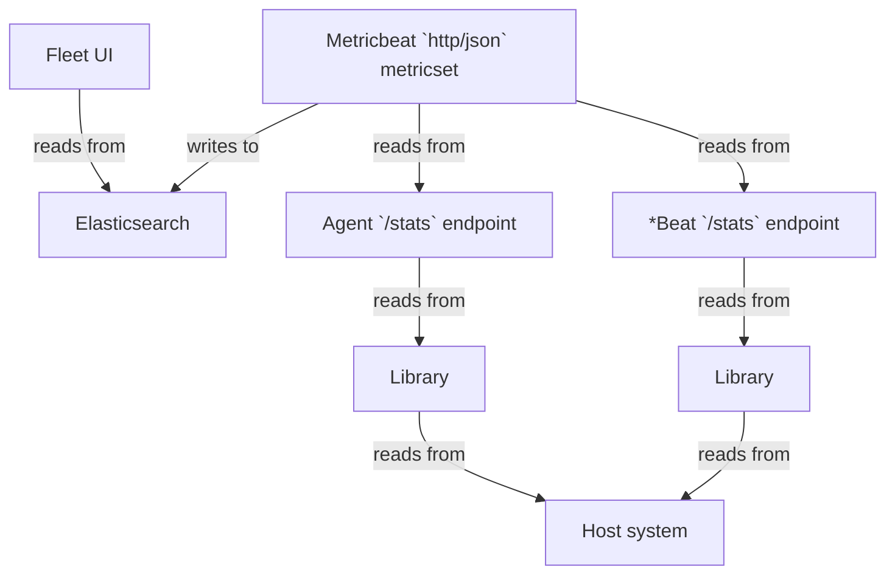

# How Agent CPU metrics in Fleet are calculated

## Journey



### Fleet UI reading from Elasticsearch

The Fleet UI code makes the following query to the `metrics-elastic_agent.*` indices in Elasticsearch.  Only CPU-related aggregations are shown; memory-related aggregations are omitted.

```json
{
  "size": 0,
  "query": {
    "bool": {
      "must": [
        {
          "terms": {
            "_tier": [ "data_hot" ]
          }
        },
        {
          "range": {
            "@timestamp": {
              "gte": "now-5m"
            }
          }
        },
        {
          "terms": {
            "elastic_agent.id": [ agentIds ]
          }
        },
        {
          "bool": {
            "filter": [
              {
                "bool": {
                  "should": [
                    {
                      "term": {
                        "data_stream.dataset": "elastic_agent.elastic_agent"
                      }
                    }
                  ]
                }
              }
            ]
          }
        }
      ]
    }
  },
  "aggs": {
    "agents": {
      "terms": {
        "field": "elastic_agent.id",
        "size": 1000
      },
      "aggs": {
        "sum_cpu": {
          "sum_bucket": {
            "buckets_path": "processes>avg_cpu"
          }
        },
        "processes": {
          "terms": {
            "field": "elastic_agent.process",
            "size": 1000,
            "order": {
              "_count": "desc"
            }
          },
          "aggs": {
            "avg_cpu": {
              "avg_bucket": {
                "buckets_path": "cpu_time_series>cpu"
              }
            },
            "cpu_time_series": {
              "date_histogram": {
                "field": "@timestamp",
                "calendar_interval": "minute"
              },
              "aggs": {
                "max_cpu": {
                  "max": {
                    "field": "system.process.cpu.total.value"
                  }
                },
                "cpu_derivative": {
                  "derivative": {
                    "buckets_path": "max_cpu",
                    "gap_policy": "skip",
                    "unit": "10s"
                  }
                },
                "cpu": {
                  "bucket_script": {
                    "buckets_path": {
                      "cpu_total": "cpu_derivative[normalized_value]"
                    },
                    "script": {
                      "source": "if (params.cpu_total > 0) { return params.cpu_total / params._interval }",
                      "lang": "painless",
                      "params": {
                        "_interval": 10000
                      }
                    },
                    "gap_policy": "skip"
                  }
                }
              }
            }
          }
        }
      }
    }
  }
}
```

### Metricbeat collects CPU metrics for Agent and the Beats it manages

There is one input in particular in the Agent policy that ultimately generates the data for the above ES query made by the Fleet UI.
* This input is of type `http/metrics`, use the `monitoring` output, and has `id` = `metrics-monitoring-agent`.
* A Metricbeat process is spawned for this input.
* There are multiple inputs in the Metricbeat configuration that generate the data for the ES query.
  * One input is for generating data for the Agent itself. This input will have `namespace` = `agent` and `id` = `metrics-monitoring-agent`.
  * The remaining inputs will generate data for the various Beats managed by Agent. The number of inputs depends on the number of Beats. These inputs will have `namespace` = `agent` and `id` = `metrics-monitoring-*beat-$n`, where `$n` is the 1-based index of the Beat.
  * All these inputs run the `http` Metricbeat module, `json` metricset, and poll `$hostname/stats` endpoint every minute, where `$hostname` is either the TCP address or unix socket path of the Agent's HTTP API or the Beats' HTTP APIs.
    * Each input has a `copy_fields` processor that copies the value of the `http.agent.beat.cpu` field to the `system.process.cpu` field.
    * Since the ES query aggregates on the `system.process.cpu.total.value` field, the corresponding field in the `$hostname/stats` API response that we're interested in is `.beat.cpu.total.value`.

