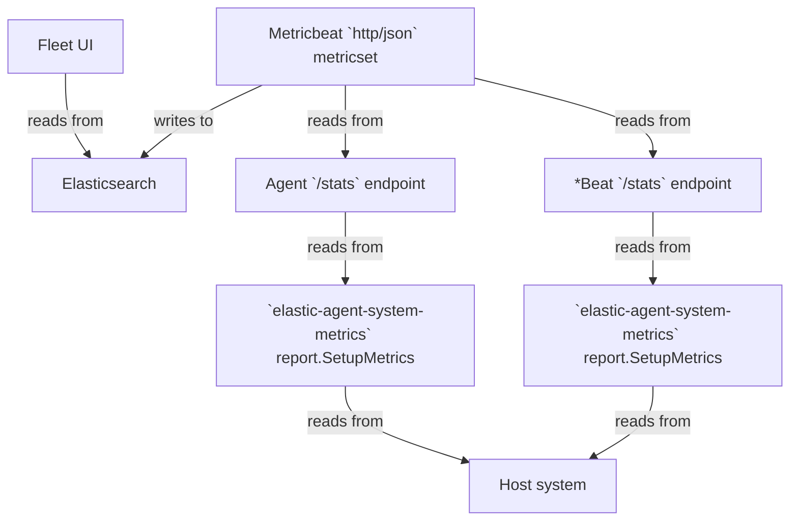

# How Agent CPU metrics in Fleet are calculated

## Journey



### Fleet UI reading from Elasticsearch

The Fleet UI code makes the following query to the `metrics-elastic_agent.*` indices in Elasticsearch.  Only CPU-related
aggregations are shown; memory-related aggregations are omitted.

```json
{
  "size": 0,
  "query": {
    "bool": {
      "must": [
        {
          "terms": {
            "_tier": [ "data_hot" ]
          }
        },
        {
          "range": {
            "@timestamp": {
              "gte": "now-5m"
            }
          }
        },
        {
          "terms": {
            "elastic_agent.id": [ agentIds ]
          }
        },
        {
          "bool": {
            "filter": [
              {
                "bool": {
                  "should": [
                    {
                      "term": {
                        "data_stream.dataset": "elastic_agent.elastic_agent"
                      }
                    }
                  ]
                }
              }
            ]
          }
        }
      ]
    }
  },
  "aggs": {
    "agents": {
      "terms": {
        "field": "elastic_agent.id",
        "size": 1000
      },
      "aggs": {
        "sum_cpu": {
          "sum_bucket": {
            "buckets_path": "processes>avg_cpu"
          }
        },
        "processes": {
          "terms": {
            "field": "elastic_agent.process",
            "size": 1000,
            "order": {
              "_count": "desc"
            }
          },
          "aggs": {
            "avg_cpu": {
              "avg_bucket": {
                "buckets_path": "cpu_time_series>cpu"
              }
            },
            "cpu_time_series": {
              "date_histogram": {
                "field": "@timestamp",
                "calendar_interval": "minute"
              },
              "aggs": {
                "max_cpu": {
                  "max": {
                    "field": "system.process.cpu.total.value"
                  }
                },
                "cpu_derivative": {
                  "derivative": {
                    "buckets_path": "max_cpu",
                    "gap_policy": "skip",
                    "unit": "10s"
                  }
                },
                "cpu": {
                  "bucket_script": {
                    "buckets_path": {
                      "cpu_total": "cpu_derivative[normalized_value]"
                    },
                    "script": {
                      "source": "if (params.cpu_total > 0) { return params.cpu_total / params._interval }",
                      "lang": "painless",
                      "params": {
                        "_interval": 10000
                      }
                    },
                    "gap_policy": "skip"
                  }
                }
              }
            }
          }
        }
      }
    }
  }
}
```

### Metricbeat collects CPU metrics for Agent and the Beats it manages

There is one input in particular in the Agent policy that ultimately generates the data for the above ES query made by
the Fleet UI. This input is of type `http/metrics`, use the `monitoring` output, and has `id` = `metrics-monitoring-agent`.
A Metricbeat process is spawned for this input.

There are multiple inputs in the Metricbeat configuration that generate the data for the ES query.
  * One input is for generating data for the Agent itself. This input will have `namespace` = `agent` and
    `id` = `metrics-monitoring-agent`.
  * The remaining inputs will generate data for the various Beats managed by Agent. The number of inputs depends on the
    number of Beats. These inputs will have `namespace` = `agent` and `id` = `metrics-monitoring-*beat-$n`, where `$n`
    is the 1-based index of the Beat.

All these inputs run the `http` Metricbeat module, `json` metricset, and poll `$hostname/stats` endpoint every minute,
where `$hostname` is either the TCP address or unix socket path of the Agent's HTTP API or the Beats' HTTP APIs. Each
input has a `copy_fields` processor that copies the value of the `http.agent.beat.cpu` field to the `system.process.cpu` field.

Since the ES query aggregates on the `system.process.cpu.total.value` field, the corresponding field in the
`$hostname/stats` API response that we're interested in is `.beat.cpu.total.value`. The `.beat.cpu.total.value` returns
a counter value representing the total (user-space + kernel-space) duration, in milliseconds, spent by the Agent or Beat
utilizing the CPU since the process was started. More on how this duration is calculated in the next section.

### Agent and Beats collect CPU metrics using `elastic-agent-system-metrics`

At startup, both Agent and Beats call the [`SetupMetrics` function](https://github.com/elastic/elastic-agent-system-metrics/blob/085e4529f3c4f91dd377cadbbe7a2bf321989438/report/setup.go#L49)
from the `github.com/elastic/elastic-agent-system-metrics/report` package.  This function registers a function with the
monitoring registry. Whenever this function is called, it calculates and reports CPU and other metrics for the process in
question.  The calculation of CPU (and other) metrics depends on the OS the Agent or Beat process is running on.

#### Linux

On Linux, CPU metrics are collected by [reading the `/proc/$PID/stat` file](https://github.com/elastic/elastic-agent-system-metrics/blob/085e4529f3c4f91dd377cadbbe7a2bf321989438/metric/system/process/process_linux_common.go#L351).
This file contains whitespace-delimited values (fields) for various process metrics and other information. The field at
index 13 (0-based indexing) is the number of CPU ticks utilized by the process in user-space since it was started. The
field at index 14 is the number of CPU ticks utilized by the process in kernel-space since it was started. As such, both
fields contain counter metrics.

We want to convert these tick values into milliseconds so it becomes easier to figure out what percentage of CPU was
utilized by the process over a given period of time.  For example, if the process utilized 120 milliseconds of CPU time
over a period of 5 minutes, that would be a CPU utilization of 120 / (5 * 60 * 1000) = 0.0004 = 0.04%.

On a typical Linux host, there are 100 ticks per second. The actual value can be checked by running `getconf CLK_TCK`.
Therefore, if a process utilized T ticks, say in user-space, we can say that the process utilized (T / 100) seconds of
CPU time == (T / 100) * 1000 milliseconds of CPU time. We do this [conversion](https://github.com/elastic/elastic-agent-system-metrics/blob/085e4529f3c4f91dd377cadbbe7a2bf321989438/metric/system/process/process_linux_common.go#L374-L375)
from ticks to milliseconds for both user-space and kernel-space CPU utilization.

Finally, we [sum up](https://github.com/elastic/elastic-agent-system-metrics/blob/085e4529f3c4f91dd377cadbbe7a2bf321989438/metric/system/process/process_linux_common.go#L376)
the user-space and kernel-space CPU utilization (which is now in milliseconds) to arrive at the total CPU utilization.

## Unanswered Questions

1. On Linux, are the tick values in `/proc/$PID/stat` the total across all cores? Or are they normalized per core? Consequently,
   is the value reported by `system.process.cpu.total.value` the total across all cores or is it normalized per core?
2. Why do we divide by 10000 (`params._interval`) in the ES query?
3. Why do we use a `10s` interval for the derivative aggregation in the ES query? Is this related to the division above?
4. The big question: how do any of these values compare to the output seen in `top` / `htop`?
