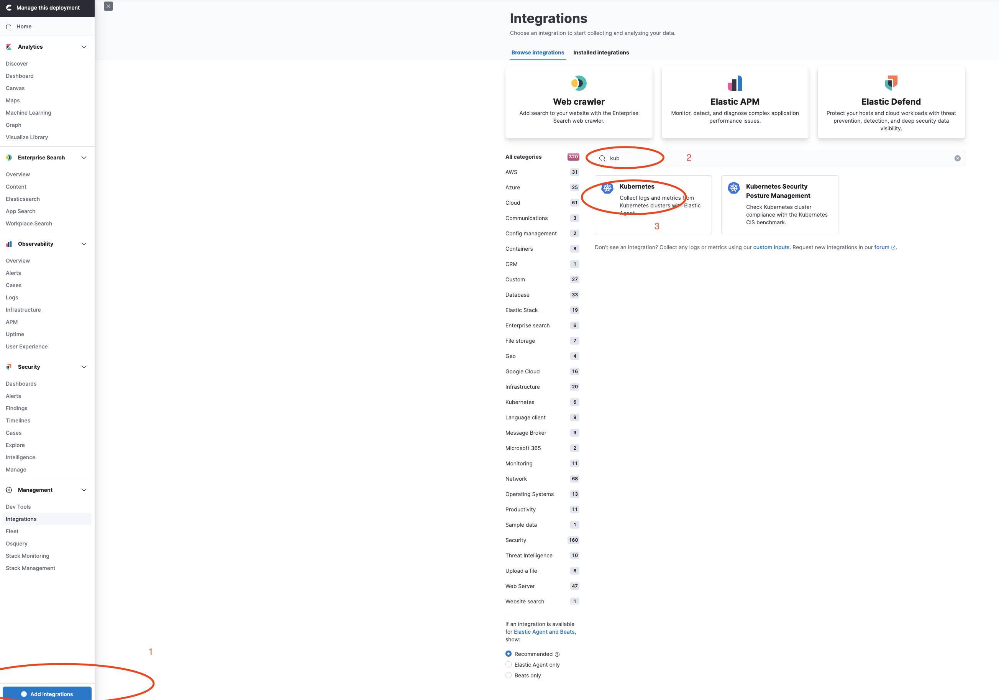
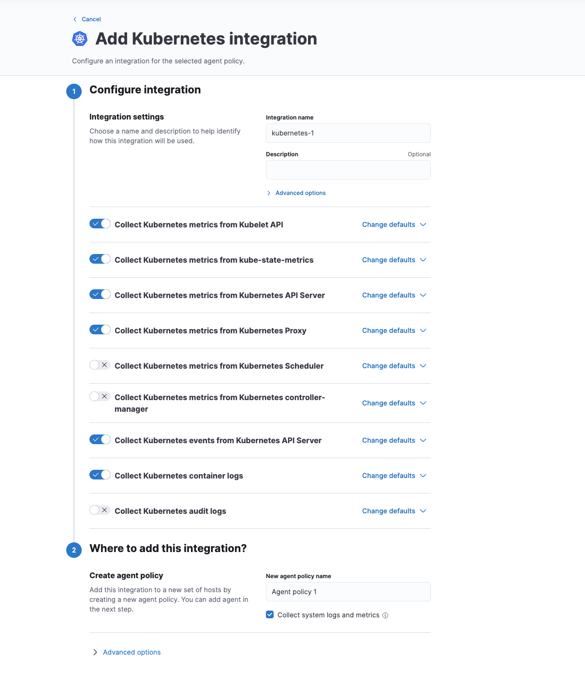
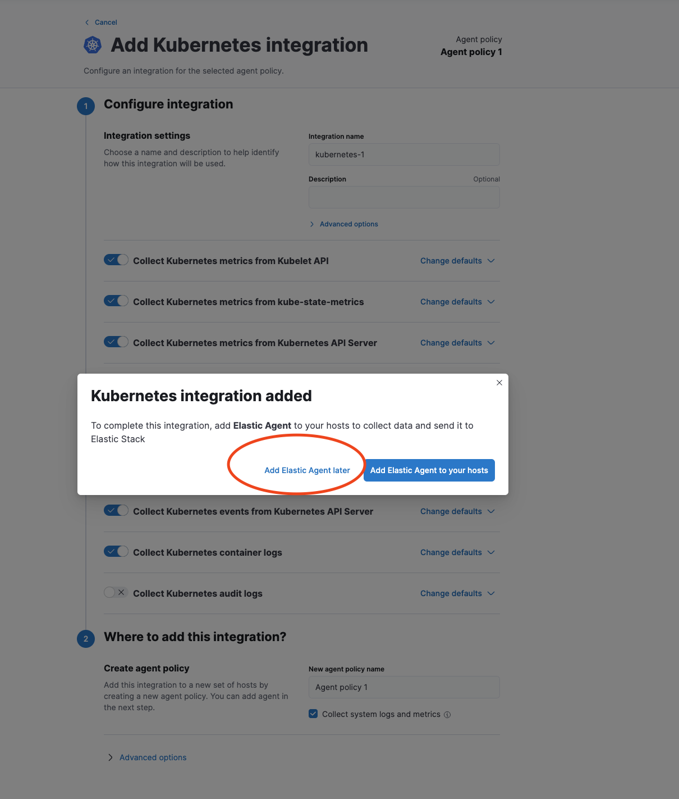
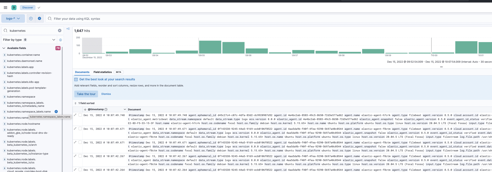
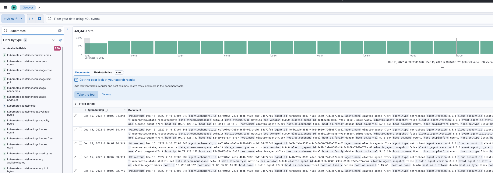
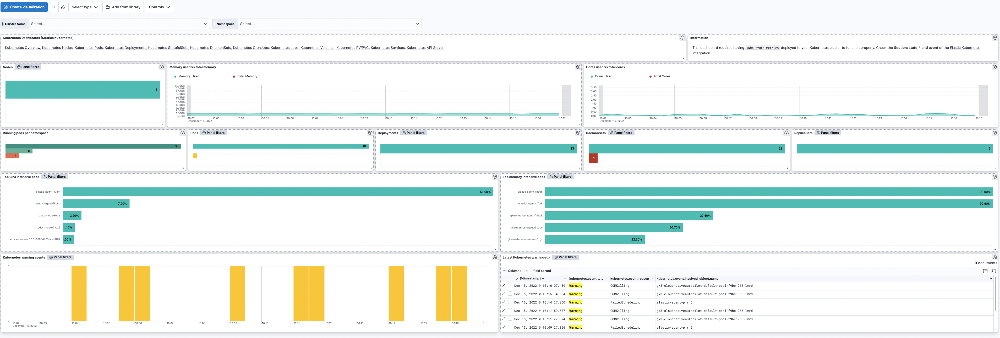

# Monitoring GKE Autopilot clusters with Elastic Observability

The goal of this document is to assist users to Kubernetes Observability of Autopilot Google Kubernetes Engine Clusters (Autopilot GKE) with Elastic Agent. Monitoring, observing and alerting of a Google Kubernetes Cluster made easy with the following simple steps. Elastic Agent is installed as daemonset inside Google Kubernetes Cluster and will send metrics/logs to a configured Elastic Cloud instance.

> Elastic Agent can be configured with multiple output setups, as part of this guide we will use Elastic Cloud

**For more information:**

- [GKE](https://cloud.google.com/kubernetes-engine)
- [Elastic Agent](https://www.elastic.co/elastic-agent)
- [Elastic Cloud](https://www.elastic.co/guide/en/cloud/current/ec-create-deployment.html)

**Prerequisities:**

- Active Google Cloud Subscription and enrollment to specific project
- [Gcloud Cli](https://cloud.google.com/sdk/gcloud) tool installed
- Elastic Cloud credentials (ES_HOST, ES_USERNAME, ES_PASSWORD)
  
  On the deployment overview page of your cloud setup, copy down the Elasticsearch Endpoint(ES_HOST).
  Username and password (ES_USERNAME, ES_PASSWORD) will be provided upon Elastic Cloud creation.

## Folow below steps to configure GKE with Elastic Agent

1. **Step 1: Initialise and login to your Google project**

This is the project where your GKE cluster will be hosted

```bash
gcloud init
[output truncated ...]

You are logged in as: [xxx].

Pick cloud project to use:
[1] example-1
[2] example-2

Please enter numeric choice or text value (must exactly match list item):  1

Your current project has been set to: [example-1].

Do you want to configure a default Compute Region and Zone? (Y/n)?  n
```

Make sure you have also login:

```bash
>gcloud auth login
  ```

2. **Step 2: Create Autopilot GKE cluster**

```bash=
>export REGION=us-central1
>export CLUSTER_NAME=cloudnativeautopilot-cluster-1

>gcloud container clusters create-auto $CLUSTER_NAME \
    --release-channel "rapid" --region $REGION \
    --cluster-version "1.25.3-gke.800"
[output truncated ...]

Creating cluster cloudnativeautopilot-cluster-1 in us-central1... Cluster is being health-checked...done.
Created [https://container.googleapis.com/v1/projects/elastic-obs-integrations-dev/zones/us-central1/clusters/cloudnativeautopilot-cluster-1].
To inspect the contents of your cluster, go to: https://console.cloud.google.com/kubernetes/workload_/gcloud/us-central1/cloudnativeautopilot-cluster-1?project=elastic-obs-integrations-dev

kubeconfig entry generated for cloudnativeautopilot-cluster-1.

NAME                            LOCATION     MASTER_VERSION  MASTER_IP      MACHINE_TYPE  NODE_VERSION    NUM_NODES  STATUS
cloudnativeautopilot-cluster-1  us-central1  1.25.3-gke.800  34.121.193.11  e2-medium     1.25.3-gke.800  3          RUNNING
```

For Cluster versions see more information in [Release Notes](https://cloud.google.com/kubernetes-engine/docs/release-notes-rapid?_ga=2.26767933.-1835820382.1670922779)

Verify that you are connected to your cluster:

```bash=
>kubectl config get-contexts
CURRENT   NAME                                                                          CLUSTER                                                                       AUTHINFO                                                                      NAMESPACE
*         gke_elastic-obs-integrations-dev_us-central1_cloudnativeautopilot-cluster-1   gke_elastic-obs-integrations-dev_us-central1_cloudnativeautopilot-cluster-1   gke_elastic-obs-integrations-dev_us-central1_cloudnativeautopilot-cluster-1
```

> In case of problems to connect to your kubernetes cluster visit `Deploy` tab under `https://console.cloud.google.com/kubernetes/clusters/details/<region>/<name_cluster>/details?project=<google_project>`.

1. **Step 3: Install Kubernetes Integration in your Elastic Cloud**

Kubernetes observability is supported through both Elastic Agent installation scenarios ([managed](https://www.elastic.co/guide/en/fleet/current/install-fleet-managed-elastic-agent.html) and [standalone](https://www.elastic.co/guide/en/fleet/current/install-standalone-elastic-agent.html)).

The Kubernetes Integration is an additional package to be installed in your Elastic Cloud and will enhance user experience for Kubernetes Observability by installing additional assets in our Elastic stack.

- Add [Kubernetes Integration](https://docs.elastic.co/integrations/kubernetes)
  


- Use default Values and click `Save and Continue`



- Choose Elastic Agent Installation:
  - a) For Managed Elastic Agent choose `Add Elastic Agent to your Hosts` . Once butoon cliked, the required  `FLEET_URL` and `FLEET_ENROLLMENT_TOKEN` will be provided for later usage inside Elastic Managed Manifest.
  - b) For Stanadlone Elastic Agent choose `Add Elastic Agent Later`



**Use Manifests of next Step 4 to complete installation**

4. **Step 4: Edit provided Agent Manifest**

Depending on the Elastc agent mode chosen, pick relevant manifest below:

1. [Elastic Agent Managed Manifest](./manifests/elastic-agent-managed-gke-autopilot.yaml)

- Set Container Image version of Elastic Agent

```yaml
containers:
    - name: elastic-agent-standalone
      image: docker.elastic.co/beats/elastic-agent:8.5.3
```

- Provide Elastic Cloud Credentials (In managed scenario you only neeed `FLEET_URL` and `FLEET_ENROLLMENT_TOKEN`)
  
```yaml
- name: FLEET_URL
  value: "https://123456.fleet.us-central1.gcp.cloud.es.io:443"
  # Elasticsearch API key used to enroll Elastic Agents in Fleet (https://www.elastic.co/guide/en/fleet/current/fleet-enrollment-tokens.html#fleet-enrollment-tokens)
  # If FLEET_ENROLLMENT_TOKEN is empty then KIBANA_HOST, KIBANA_FLEET_USERNAME, KIBANA_FLEET_PASSWORD are needed
  - name: FLEET_ENROLLMENT_TOKEN
  value: "WmpQbUVJVUJnX0kE6aDg0OGVtNG1TTDJqWlM2VGp"
  ```

2. [Elastic Agent Stanadlone Manifest](./manifests/elastic-agent-standalone-gke-autopilot.yaml)

- Set Container Image version of Elastic Agent

```yaml
containers:
    - name: elastic-agent-standalone
      image: docker.elastic.co/beats/elastic-agent:8.5.3
```

- Provide Elastic Cloud Credentials
  
```yaml
# This user needs the privileges required to publish events to Elasticsearch.
- name: ES_USERNAME
  value: "elastic"
# The basic authentication password used to connect to Elasticsearch
- name: ES_PASSWORD
  value: "changeme"
# The Kibana host to communicate with
- name: ES_HOST
  value: "https://<url>:<port>"
- name: NODE_NAME
```

> **1. Note**: Depending on the size of your kubernetes cluster, users need to adjust the resource limits of your agent daemonset accordingly.

> **2. Note**: Access to kube-system namespace is not allowed in autopilot clusters. That said, provided manifests create and make use of a new created namespace `elastic-agent`. Additionally some mounting capabilities are restricted in specific host paths.

> **3. Note**: Provided manifests make use of PriorityClass in order to allow elastic-agent to be scheduled before other application pods.

1. **Step 5: Install Elastic Agent Manifest:**

For example:

```bash=
>kubectl apply -f elastic-agent-managed-kubernetes_gke_autopilot.yaml

namespace/elastic-agent created
configmap/agent-node-datastreams created
Warning: Autopilot increased resource requests for DaemonSet elastic-agent/elastic-agent-standalone to meet requirements. See http://g.co/gke/autopilot-resources
daemonset.apps/elastic-agent-standalone created
clusterrolebinding.rbac.authorization.k8s.io/elastic-agent-standalone created
rolebinding.rbac.authorization.k8s.io/elastic-agent-standalone created
rolebinding.rbac.authorization.k8s.io/elastic-agent-standalone-kubeadm-config created
clusterrole.rbac.authorization.k8s.io/elastic-agent-standalone created
role.rbac.authorization.k8s.io/elastic-agent-standalone created
role.rbac.authorization.k8s.io/elastic-agent-standalone-kubeadm-config created
serviceaccount/elastic-agent-standalone created
```

> Elastic Agent is installed in namespace `elastic-agent`

6. **Step 6: Install Kube-state metrics**

> Kube-state Metrics needs to be installed in the same namespace as Elastic Agent

Install through helm from [here](https://github.com/prometheus-community/helm-charts/tree/main/charts/kube-state-metrics)

```bash
helm repo add prometheus-community https://prometheus-community.github.io/helm-charts
helm repo update
helm install [RELEASE_NAME] prometheus-community/kube-state-metrics --namespace <namespace>
```

In some cases you need to wait the auto-scheduler to scale up your cluster in order kube-state metrics to install successfully

```bash=
 >kubectl describe -n elastic-agent pod/kube-state-metrics-7f6f7d4d99-lq965
[output truncated ...]
....
  Normal   TriggeredScaleUp  7m10s                 cluster-autoscaler                     pod triggered scale-up: [{https://www.googleapis.com/compute/v1/projects/elastic-obs-integrations-dev/zones/us-central1-a/instanceGroups/gk3-cloudnativeautopilot-nap-1ei06cgr-897ebe30-grp 0->1 (max: 1000)}]
  Warning  FailedScheduling  6m34s (x16 over 11m)  gke.io/optimize-utilization-scheduler  0/2 nodes are available: 2 Insufficient cpu, 2 Insufficient memory. preemption: 0/2 nodes are available: 2 No preemption victims found for incoming pod.
  Warning  FailedScheduling  6m24s                 gke.io/optimize-utilization-scheduler  0/3 nodes are available: 1 node(s) had untolerated taint {node.kubernetes.io/not-ready: }, 2 Insufficient cpu, 2 Insufficient memory. preemption: 0/3 nodes are available: 1 Preemption is not helpful for scheduling, 2 No preemption victims found for incoming pod.
  Normal   Scheduled         6m1s                  gke.io/optimize-utilization-scheduler  Successfully assigned elastic-agent/kube-state-metrics-7f6f7d4d99-lq965 to gk3-cloudnativeautopilot-nap-1ei06cgr-897ebe30-565t
  Normal   Pulling           5m44s                 kubelet                                Pulling image "registry.k8s.io/kube-state-metrics/kube-state-metrics:v2.7.0"
  Normal   Pulled            5m17s                 kubelet                                Successfully pulled image "registry.k8s.io/kube-state-metrics/kube-state-metrics:v2.7.0" in 26.345675198s
  Normal   Created           5m17s                 kubelet                                Created container kube-state-metrics
  Normal   Started           5m17s                 kubelet                                Started container kube-state-metrics
❯ kubectl get nodes
NAME                                                  STATUS   ROLES    AGE     VERSION
gk3-cloudnativeautopilot-default-pool-324d684e-73lk   Ready    <none>   158m    v1.25.3-gke.800
gk3-cloudnativeautopilot-default-pool-f9bc1966-lmrd   Ready    <none>   158m    v1.25.3-gke.800
gk3-cloudnativeautopilot-nap-1ei06cgr-897ebe30-565t   Ready    <none>   6m48s   v1.25.3-gke.800
```

7. **Step 7: Verify Ingestion of Logs/Metrics**

Verify in your Agent logs that basic components of Agent have started:

```bash=
❯ kubectl logs -n elastic-agent elastic-agent-f8ctm | grep -i running | grep metricbeat
{"log.level":"info","@timestamp":"2022-12-15T09:00:45.603Z","log.origin":{"file.name":"log/reporter.go","file.line":40},"message":"2022-12-15T09:00:45Z - message: Application: metricbeat--8.5.3--36643631373035623733363936343635[81634785-f5cb-4971-bfaf-f76e3dde9ba8]: State changed to STARTING: Starting - type: 'STATE' - sub_type: 'STARTING'","ecs.version":"1.6.0"}

❯ kubectl logs -n elastic-agent elastic-agent-f8ctm | grep -i running | grep filebeat
{"log.level":"info","@timestamp":"2022-12-15T08:05:41.064Z","log.origin":{"file.name":"log/reporter.go","file.line":40},"message":"2022-12-15T08:05:41Z - message: Application: filebeat--8.5.0[4aa5da9b-f40f-4fea-9290-5697a40c0544]: State changed to STARTING: Starting - type: 'STATE' - sub_type: 'STARTING'","ecs.version":"1.6.0"}
```

Login to your Elastic Cloud Instance and navigate to **Analytics>Discover**:

Choose `Logs-* Dataview` to view logs:



Choose `Metrics-* Dataview` to view metrics:



Because kubernetes integration is already installed, dashboards are availbale for users to observe kubernetes cluster status.

Navigate to **Analytics>Dashboards**


