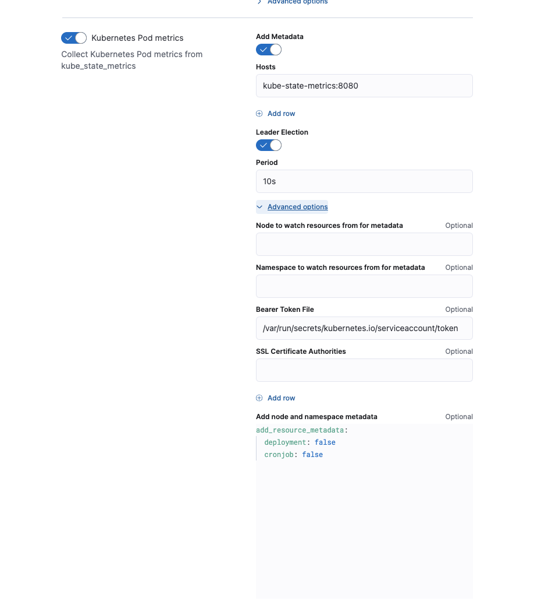
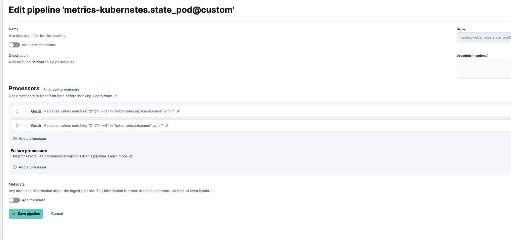
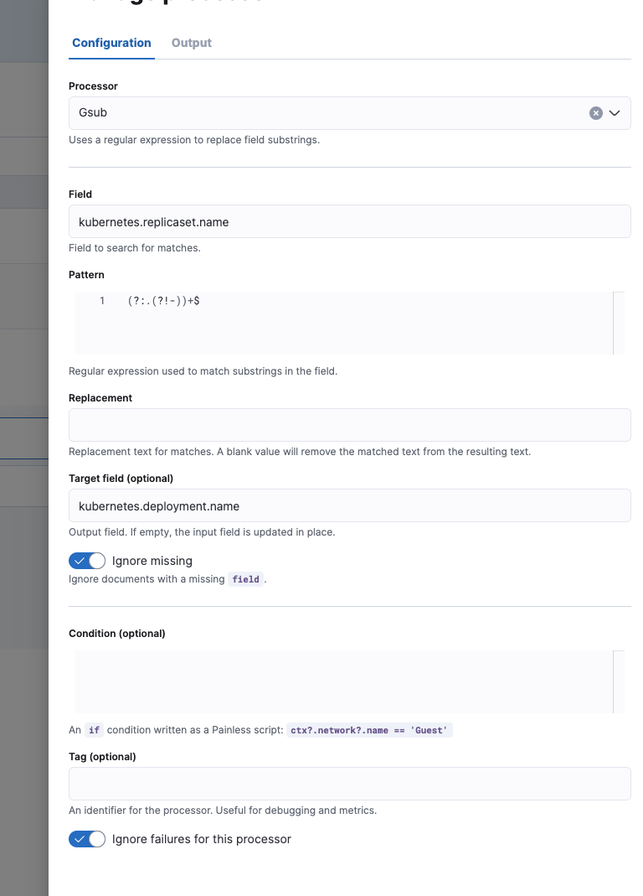
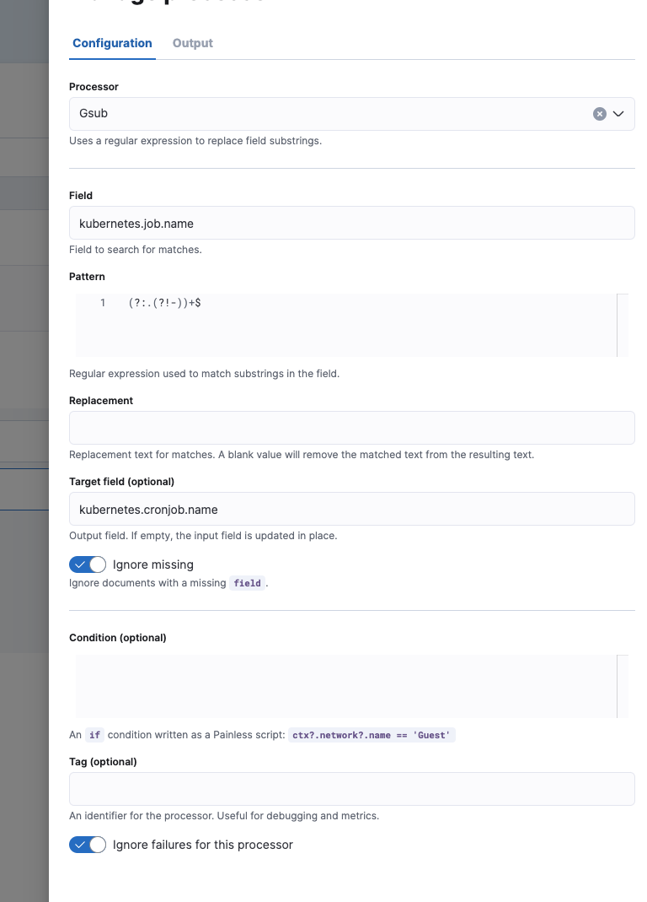

# Using Custom Ingest Pipeline with Kubernetes Integration

This tutorial explains how to add a custom ingest pipeline to Kubernetes Integration in order to add specific metadata fields for deployments and cronjobs of pods.

Custom pipelines can be used to add custom data processing, like adding fields, obfuscate sensitive information, and more. Find more information in [data-streams-pipeline-tutorial](https://www.elastic.co/guide/en/fleet/master/data-streams-pipeline-tutorial.html) on how to use custom ingest pipelines.

## Metadata Enrichment for Kubernetes

The [Kubernetes Integration](https://docs.elastic.co/en/integrations/kubernetes) is used to collect logs and metrics from Kubernetes clusters with Elastic Agent. During the collection, integration enhances the collected information with extra useful information that can help users to correlate information and different Kubernetes assets with each other. All this additional information that are added on top of collected information like labels, annotations, ancestor names of Kubernetes assets etc. are called metadata.

The [Kubernetes Provider](https://www.elastic.co/guide/en/fleet/current/kubernetes-provider.html) offers the `add_resource_metadata` option to configure the metadata enrichment options.

Since version [8.10.4](https://www.elastic.co/guide/en/fleet/current/release-notes-8.10.4.html), the default configuration for metadata enrichment is `add_resource_metadata.deployment=false` and `add_resource_metadata.cronjob=false`. This means that pods that created from replicasets that belong to specific deployments would not be enriched with `kubernetes.deployment.name`. Additionally, pods that are created from jobs that belong to specific cronjobs, would not be enriched with `kubernetes.cronjob.name`.

**Kubernetes Integration Policy > Collect Kubernetes metrics from Kube-state-metrics > Kubernetes Pod Metrics**

<center></center>

Eg. Enabling the enrichment through `add_resource_metadata` in Managed Elastic Agent Policy

Enabling deployment and cronjob metadata enrichment will utilize more memory because Elastic Agent keeps a local memory with the assets being discovered.

## Add deployment and cronjob for Kubernetes pods through ingest pipelines

Alternative to keeping the feature on and use more memory resources for Elastic Agent, users can make use of inegst pipelines to add the missing fields of `kubernetes.deployment.name` and `kubernetes.cronjob.name`.

Following article [data-streams-pipeline-tutorial](https://www.elastic.co/guide/en/fleet/master/data-streams-pipeline-tutorial.html), navigate to `state_pod` datastream under: **Kubernetes Integration Policy > Collect Kubernetes metrics from Kube-state-metrics > Kubernetes Pod Metrics**

Create the following custom ingest pipeline with two processors:
<center></center>

**Processor for Deployment:**

<center></center>

**Processor for Cronjob:**

<center></center>


The final `metrics-kubernetes.state_pod@custom` ingest pipeline:

```json
[
  {
    "gsub": {
      "field": "kubernetes.replicaset.name",
      "pattern": "(?:.(?!-))+$",
      "replacement": "",
      "target_field": "kubernetes.deployment.name",
      "ignore_missing": true,
      "ignore_failure": true
    }
  },
  {
    "gsub": {
      "field": "kubernetes.job.name",
      "pattern": "(?:.(?!-))+$",
      "replacement": "",
      "target_field": "kubernetes.cronjob.name",
      "ignore_missing": true,
      "ignore_failure": true
    }
  }
]
```
