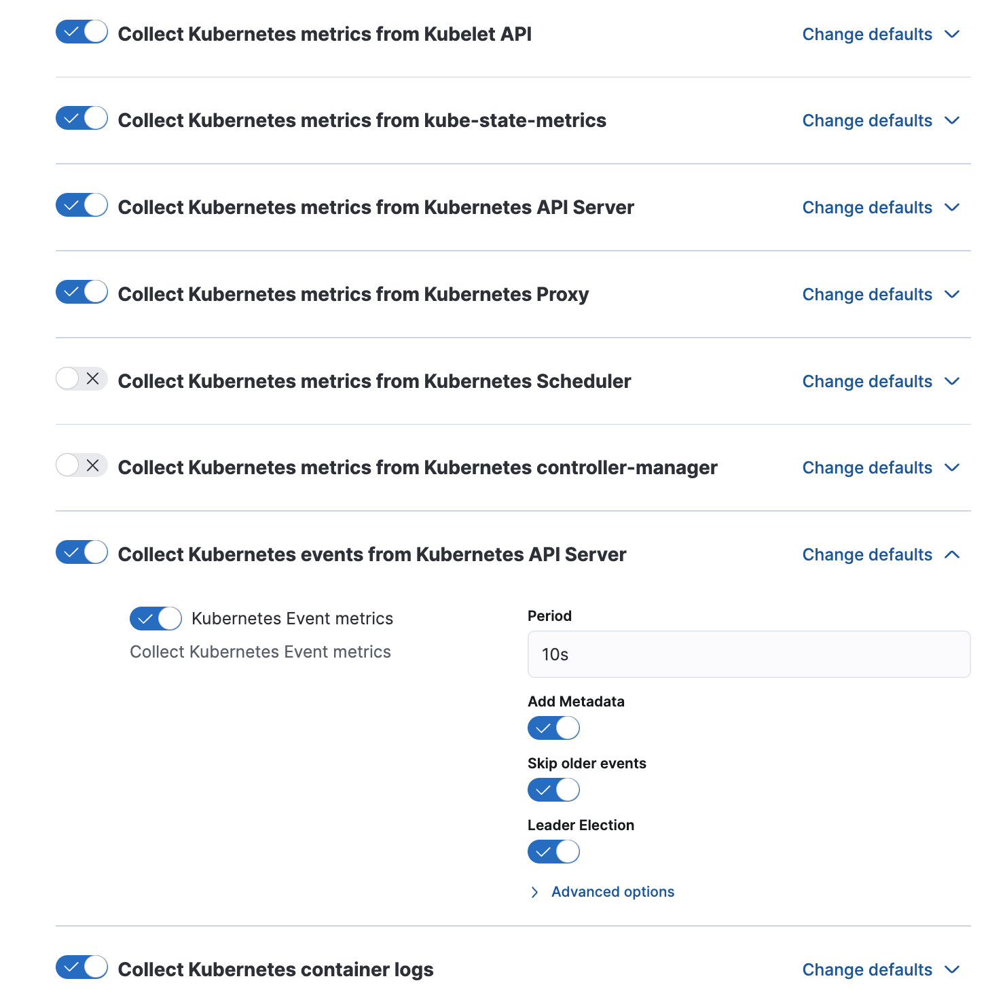
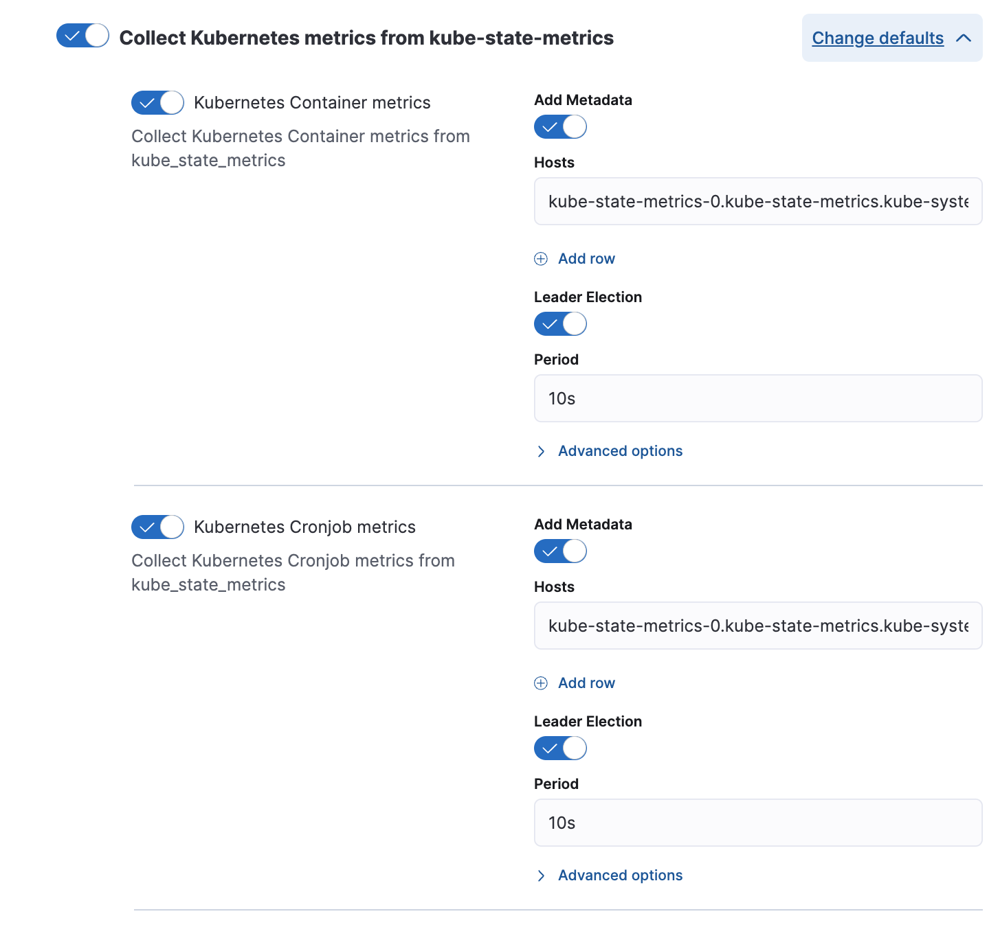
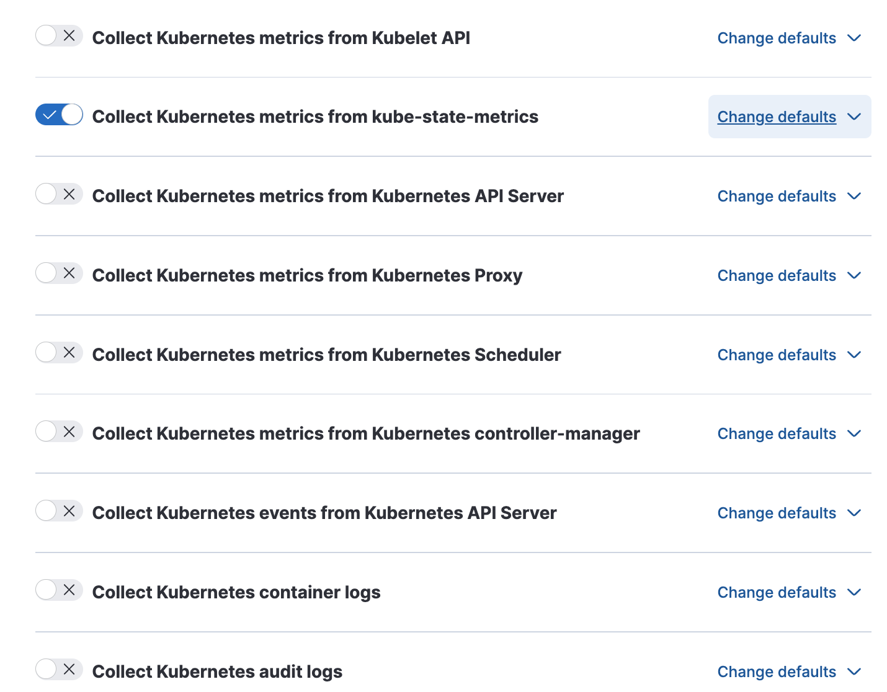
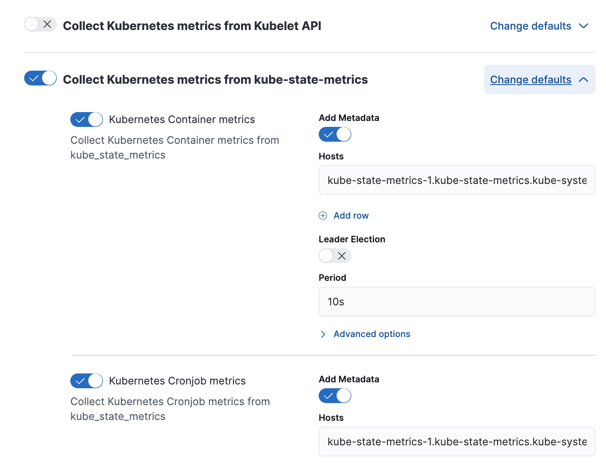
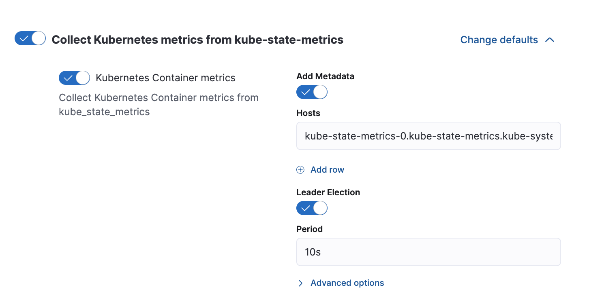
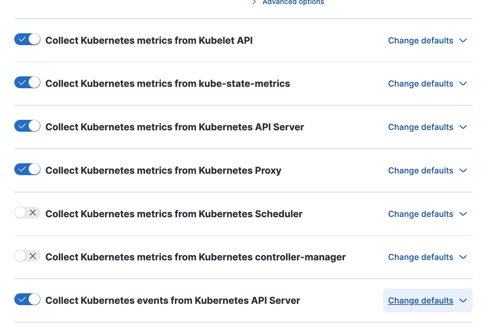
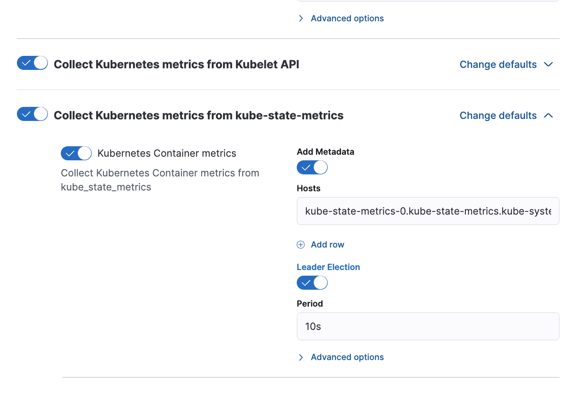
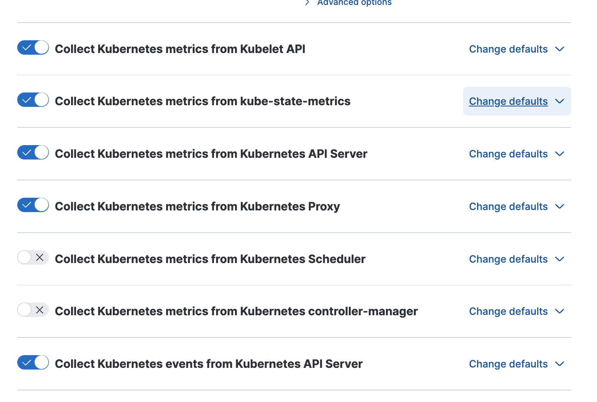

# Elastic Agent Manifests in order to support Kube-State-Metrics Sharding

Kube-state-metrics (KSM) library provides [horizontal sharding](https://github.com/kubernetes/kube-state-metrics#horizontal-sharding) in order to support large kubernetes deployments. As Elastic-Agent collection from kube-state-metrics is proved to be resource intensive, we need to be able to support such horizontal scaling scenarios with our configuration. This doc aims to provide information on how to configure Elastic Agent with KSM horizontally sharded.

## Kube State Metrics Configuration

Deploy kube-state metrics with autosharding (by default number of replicas is 2)

```bash
git clone https://github.com/kubernetes/kube-state-metrics
cd kube-state-metrics/examples/autosharding 
kubectl apply -k .
```

The default dns entries for to access created ksm pods are (assuming namespace of installation of KSM remains default: `kube-system`):

- **KSM Shard01:** kube-state-metrics-0.kube-state-metrics.kube-system.svc.cluster.local:8080
- **KSM Shard02:** kube-state-metrics-1.kube-state-metrics.kube-system.svc.cluster.local:8080

## Installation methods of elastic-agent

This document suggests **3 alternative configuration methods** to deploy elastic-agent in big scale Kubernetes clusters with KSM in sharding configuration:

1. With `hostNetwork:false` for non-leader deployments of KSM shards
2. With `podAntiAffinity` to isolate the daemonset pods from rest of deployments
3. With `taint/tolerations` to isolate the daemonset pods from rest of deployments

Each configuration includes specific pros and cons and users may choose what best matches their needs.

The Kubernetes observability is based on [kubernetes integration](https://docs.elastic.co/en/integrations/kubernetes), which is fetching metrics from several components:

- **Per node:**
  - kubelet
  - controller-manager
  - scheduler
  - proxy
- **Cluster Wide (i.e. correspond to the whole cluster):**
  - kube-state-metrics
  - apiserver

The Elastic Agent manifest is deployed by default as daemonset. That said, each elastic agent by default is being deployed on every node of kubernetes cluster.

Additionally by default, one agent is elected as [**leader**](https://github.com/elastic/elastic-agent/blob/main/deploy/kubernetes/elastic-agent-standalone-kubernetes.yaml#L32) and this will be responsible for also collecting the cluster wide metrics.

So let us discuss each alternative configuration method above. We will provide relevant [manifests](./manifests) to assist installation. We will describe the managed agent installation scenario (for simplicity we would not mention standalone scenarios, but relevant [manifests](./manifests) will be provided for both scenarios)

### 1. HostNetwork:false Installation

For this installation, users need to configure the two following agent policies.

**Agent policies:**

- Leader Daemonset Policy:
Keep enabled all the default datasets

- Only change the kube-state-metrics endpoint url to point to `kube-state-metrics-0`


- Deployment policy for rest of shards. **Repeat and create same policies for each shard you have created with KSM installation**
Disable all the default datasets except KSM

- Change the kube-state-metrics endpoint url to point to `kube-state-metrics-1`


**Manifest Installation:**

Deploy following manifests:

```bash
 kubectl apply -f elastic-agent-managed-daemonset-ksm-0.yaml
 kubectl apply -f elastic-agent-managed-deployment-ksm-1.yaml
```

> **Note**: Above manifests exist under [manifests/hostnetwork](./manifests/hostnetwork) folder

> **Note**: Make sure that `hostNetwork:false` in [elastic-agent-managed-deployment-ksm-1.yaml](./manifests/kubernetes_deployment_ksm-1.yaml#40).

**Pros/Cons**:

- [+] Simplicity
- [-] You can not prevent execution of deployments in nodes where agents already running.

### 2. PodAntiAffinity Installation

For this installation, users need to configure the following agent policies:

**Agent policies:**

- Create a policy to be assigned to daemonset resources. 
  - a) This policy will have enabled *only node-wide* metric datasets (like kubelet, proxy, scheduler or controller).
  - b) **Disable KSM and Apiserver datasets**
- Create a second policy for first KSM shard resources. For this policy you need to:
  - a) Enable leader election from KSM (with url `kube-state-metrics-0.kube-state-metrics.kube-system.svc.cluster`) and also
  
  - b) Enable the APiServer dataset
  
  - c) Enable any extra node-wide metric datasets (like kubelet, proxy, scheduler or controller
(- Repeat policy creation for rest KSM shards. **One deployment needs to be assigned per KSM shard**:  
  - a) Disable APIServer dataset
  - b) Enable any extra node-wide metric datasets (like kubelet, proxy, scheduler or controller)

Reason is that now the deployment agent pods will run isolated in specific nodes. This method actually implies that first agent that will be installed from deployment is the leader of your cluster.

**Manifest Installation:**

1. Make sure that `hostNetwork:true` in [elastic-agent-managed-deployment-ksm-1.yaml](./manifests/kubernetes_deployment_ksm-1.yaml#40). This option is not needed anymore and can be reverted in this scenario
2. Uncomment the following `affinity` block in both manifests [elastic-agent-managed-daemonset-ksm-0.yaml](./manifests/affinity/elastic-agent-managed-daemonset-ksm-0.yaml), [elastic-agent-managed-deployment-ksm-1.yaml](./manifests/affinity/elastic-agent-managed-deployment-ksm-1.yaml)

   ```bash
    affinity:
        podAntiAffinity:  
          requiredDuringSchedulingIgnoredDuringExecution:
          - labelSelector:
              matchExpressions:                            
              - key: app
                operator: In
                values:                          
                  - "elastic-agent"
            topologyKey: "kubernetes.io/hostname"
   ```

The above configuration ensures that no more than one pod with `label="elastic-agent"` will be executed in each node.

Then deploy manifests:

```bash
 kubectl apply -f elastic-agent-managed-deployment-ksm-0.yaml
 kubectl apply -f elastic-agent-managed-deployment-ksm-1.yaml
 kubectl apply -f elastic-agent-managed-daemonset.yaml
```

> **Note:** : Order of deploying manifests is important. You need first to install deployments and then daemonset, otherwise deployments will not find a node available for scheduling.

> **Note**: Above manifests exist under [manifests/affinty](./manifests/affinty) folder


Verify installation:

```bash
❯ kgp -A | grep elastic
kube-system   elastic-agent-64ctk                                              1/1     Running   0          4m44s
kube-system   elastic-agent-8db69556b-6t4qv                                    1/1     Running   0          4m48s
kube-system   elastic-agent-cj2zk                                              1/1     Running   0          4m44s
kube-system   elastic-agent-rlnqk                                              1/1     Running   0          4m44s
kube-system   elastic-agent-tt5lg                                              1/1     Running   0          4m44s
kube-system   elastic-agent-txxfp                                              0/1     Pending   0          4m44s
```

> **Note:**: Elastic agent from deployment has a different naming, eg. `elastic-agent-8db69556b-6t4qv`

**Pros/Cons**:

- [+] You *can* prevent execution of deployments in nodes where agents already running.
- [-] More complex than first method
- [-] It displays scheduled daemonset pods in state `Pending` where antiaffinity is triggered.

### Tolerations Installation

**Agent Policies:**
For this installation, users need to configure the same agent policies as described in first scenario (aka hostnetwork configuration).

- Daemonset resources will include the leader ksm and apiserver.
  
  
  

- **One Agent Policy per KSM shard URL endpoint needs to be assigned to a different deployment**
  - a) Leader Election should be disabled in all deployments

**Manifest Installation:**

1. Revert any changes from previous scenarios. Make sure that `hostNetwork:true` in [elastic-agent-managed-deployment-ksm-1.yaml](./manifests/kubernetes_deployment_ksm-1.yaml#40). This option is not needed anymore and can be reverted in this scenario. Also verify that  `affinity` block is commented.
2. Uncomment the following `toleration` in manifest [elastic-agent-managed-deployment-ksm-1.yaml](./manifests/tolerations/elastic-agent-managed-deployment-ksm-1.yaml). Only the deployments need to include tolerations

   ```bash
    tolerations:
        - key: "deployment"
            operator: "Equal"
            value: "yes"
            effect: "NoSchedule"
   ```

3. Taint a specific node that you want to exclude from being assigned to daemonset pods

    ```bash
    kubectl taint nodes gke-kubernetes-scale-kubernetes-scale-0f73d58f-4rt9 deployment=yes:NoSchedule
    ```

4. Deploy your manifests:

    ```bash
    kubectl apply -f elastic-agent-managed-daemonset-ksm-0.yaml
    kubectl apply -f elastic-agent-managed-deployment-ksm-1.yaml
    ```

> **Note**: Above manifests exist under [manifests/tolerations](./manifests/tolerations) folder


**Pros/Cons**:

- [+] You *can* prevent execution of deployments in nodes where agents already running
- [+] Gives possibilities to users to configure the pod scheduling exactly as they need
- [-] More complex method and requires manual steps
