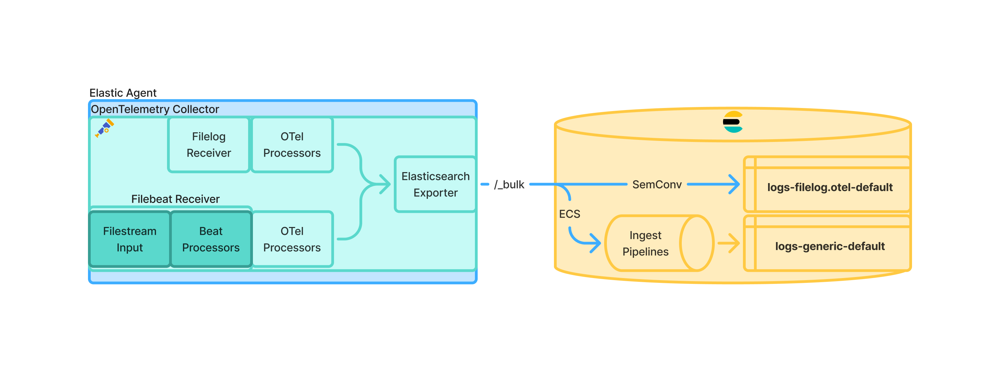

# Hybrid Agent and Beats Receivers

This page provides a brief overview of the Beat receivers and Hybrid Agent projects and how to experiment with them.
These are part of Elastic's larger effort to base data collection on OpenTelemetry technologies. For more context, see
https://www.elastic.co/observability-labs/blog/elastic-agent-pivot-opentelemetry. This document does not aim to be a
comprehensive explanation of beat receivers or hybrid agent as concepts, it is only a brief overview along with
testing instructions. Beat receivers and hybrid agent capabilities are available starting with the 9.1.0 and 8.19.0
releases at a technical preview level and are not enabled or used by default.

## Beat Receivers

**Beat Receivers** are beat inputs and processors executing as a receiver in an OpenTelemetry collector pipeline.
Beat receivers are designed to output the exact same data they do today, and do not output data in the OTLP schema.

Beat receivers will eventually be the default execution mode for Beat inputs in an elastic-agent.yml file (whether
written by hand or generated via Fleet). Elastic Agent will automatically translate the relevant parts of it's
elastic-agent.yml file into OpenTelemetry collector configurations and execute them in the collector. This capability
is currently gated by a feature flag.

### Beat Receivers for Agent Monitoring

The first part of the Elastic Agent configuration that will run as Beat receivers
by default will be the self-monitoring functionality. To use Beat receivers for self-monitoring set the
`_runtime_experimental: "otel"` feature flag in the `agent.monitoring` section of the configuration:

```yaml
agent.monitoring:
  enabled: true
  logs: true
  metrics: true
  _runtime_experimental: otel
```

This setting will be available as a toggle in the Fleet UI as part of the agent policy advanced settings once
https://github.com/elastic/kibana/issues/233186 is implemented. Before that change is implemented, the agent policy
overrides API can be used to add `_runtime_experimental: "otel"` to the `agent.monitoring` section of the policy.
See https://support.elastic.dev/knowledge/view/06b69893 for details on the policy overrides API.

For the Elastic Agent container images, the `AGENT_MONITORING_RUNTIME_EXPERIMENTAL` environment variable can be set to either `process` or `otel` to override the default runtime used for agent monitoring.

Executing the `elastic-agent diagnostics` command in this mode will now produce an `otel-final.yml` file showing the generated
collector configuration used to run the Beat receivers.

### Beat Receivers for Data Collection

The capability to use Beat receivers is being enabled on per Beat and per input type basis. At the time of writing (August 2025),
Filebeat and Metricbeat can run as receivers and both the `filestream` and `system/metrics` inputs work outside of
monitoring use cases.

With the changes in https://github.com/elastic/elastic-agent/pull/11186 a new `agent.internal.runtime` section allows controlling
the default runtime where `otel` indicates the input should run as a receiver. The default can be controlled on a per Beat and per
input basis.

At the time of writing (January 2026), the logic for selecting the
runtime prioritises the most specific setting, which might be hard
coded. Therefore it is recommended to always set the desired runtime
for the specific input. For example to run the `filestream` and
`system/metrics` inputs as Beat receivers:

```yaml
agent:
  internal:
    runtime:
      default: process # Run all beats and inputs as sub-processes unless overridden below or by harcoded defaults.
      filebeat:
        default: process # Run all Filebeat inputs as sub-processe unless overidden individually or by harcoded defaults.
        filestream: otel # Run the Filebeat filestream input as a beat receiver.
      metricbeat:
        default: process # Run all Metricbeat inputs as sub-processe unless overidden individually or by harcoded defaults.
        system/metrics: otel # Run the Metricbeat system/metrics input as a beat receiver.
inputs:
  - id: system-metrics-receiver
    type: system/metrics
    streams:
      - metricsets:
        - cpu
        data_stream.dataset: system.cpu
  - id: filestream-receiver
    type: filestream
    data_stream.dataset: generic
    paths:
        - /var/log/*.log
outputs:
  default:
    type: elasticsearch
    hosts: [http://localhost:9200]
    api_key: placeholder
```

### Configuration Translation Overrides

When an input is executed as a Beat receiver, it is injected into an OpenTelemetry collector pipeline that was
generated based on the associated output. The `ssl`, `proxy*`, and other transport settings are added to a generated
[beatsauth extension](https://github.com/elastic/beats/tree/da79b6ecce2fd9cc9403f8041aea10616ba93c57/x-pack/otel/extension/beatsauthextension)
instance which allows the collector to use the Beat SSL settings and underlying HTTP transport to guarantee the behavior is the same as before.
Similarly, when using the Elasticsearch output an [elasticsearch exporter](https://github.com/open-telemetry/opentelemetry-collector-contrib/tree/main/exporter/elasticsearchexporter)
instance is generated with a configuration equivalent to the previous Elasticsearch output in Beats using the `bodymap` mapping mode to
continue to generate ECS documents.

The changes in https://github.com/elastic/elastic-agent/pull/10992 added a way to override or extend the translated beatsauth extension and
elasticsearch exporter parameters in case there is a problem or bug with the translation process. For example:

```yaml
outputs:
  default:
    type: elasticsearch
    hosts: [127.0.0.1:9200]
    api_key: "example-key"
    otel:
      extensions:
        beatsauth:
          timeout: "60s" # Override the connection timeout from the translated value.
      exporter:
        include_source_on_error: false # Override the generated value of include_source_on_error.
```

## Hybrid Agent

**Hybrid Agent** refers the capability of Elastic Agent to run OpenTelemetry collector pipelines specified directly in
it's elastic-agent.yml file. This allows running Beat based ECS data collection alongside OTLP native data collection in
the same agent. The diagram below shows the end state of the Elastic Agent where both Beats (via Beat receivers) and OpenTelemetry
collector receivers run in the same collector process.



A runnable Hybrid agent example configuration follows below.

```yaml
agent.monitoring:
  enabled: true
  logs: true
  metrics: true

outputs:
  default:
    type: elasticsearch
    hosts: [127.0.0.1:9200]
    api_key: "example-key"
    preset: balanced

inputs:
  - id: filestream-system-66cab0a6-6fa3-46b1-9af1-2ea171fbd887
    type: filestream
    # _runtime_experimental: otel # Optional - also run the filestream input as a collector receiver.
    data_stream:
      namespace: default
    streams:
      - id: filestream-system.auth-66cab0a6-6fa3-46b1-9af1-2ea171fbd887
        data_stream:
          dataset: system.auth
        paths:
          - /var/log/auth*.log

receivers:
  httpcheck/httpcheck-6d24bb0d-5349-4714-a7ea-2988abcb928b:
    collection_interval: 30s
    targets:
      - method: "GET"
        endpoints:
            - https://example.com

processors:
  transform/httpcheck-6d24bb0d-5349-4714-a7ea-2988abcb928b:
    metric_statements:
      - delete_key(datapoint.attributes,"http.status_class")

exporters:
  debug/default:
    verbosity: detailed

service:
  pipelines:
    metrics/httpcheck-6d24bb0d-5349-4714-a7ea-2988abcb928b:
      receivers: [httpcheck/httpcheck-6d24bb0d-5349-4714-a7ea-2988abcb928b]
      processors: [transform/httpcheck-6d24bb0d-5349-4714-a7ea-2988abcb928b]
      exporters: [debug/default]
```

## OTel Mode

The elastic agent can also be executed in "Otel mode" by executing the `elastic-agent otel` command. This immediately invokes
the entrypoint of the EDOT OpenTelemetry collector bypassing all other Elastic Agent functionality. In this mode Fleet management is
not available and elastic-agent.yml configurations cannot be executed. Beat receivers are still usable in this mode, but they must be
configured manually like any other receiver.

An example showing how to configure Beat receivers directly in a collector pipeline that will execute with the `elastic-agent otel` command
follows below. The pipeline below is a simplified version of the one generated to run the `filestream` and `system/metrics` inputs as receivers
show earlier.

```yaml
receivers:
    filebeatreceiver:
        filebeat:
            inputs:
                - data_stream:
                    dataset: generic
                  id: filestream-receiver
                  index: logs-generic-default
                  paths:
                    - /var/log/*.log
                  type: filestream
        queue.mem.flush.timeout: 0s
    metricbeatreceiver:
        metricbeat:
            modules:
                - data_stream:
                    dataset: system.cpu
                  index: metrics-system.cpu-default
                  metricsets:
                    - cpu
                  module: system
        queue.mem.flush.timeout: 0s
exporters:
    elasticsearch/_agent-component/default:
        api_key: placeholder
        compression: gzip
        compression_params:
            level: 1
        endpoints:
            - http://localhost:9200
        logs_dynamic_id:
            enabled: true

        retry:
            enabled: true
            initial_interval: 1s
            max_interval: 1m0s
            max_retries: 3

        sending_queue:
            enabled: true
            wait_for_result: true
            block_on_overflow: true
            num_consumers: 1
            queue_size: 3200
            batch:
                max_size: 1600
                min_size: 0
                flush_timeout: 10s
                sizer: items
service:
    pipelines:
        logs:
            exporters:
                - elasticsearch/_agent-component/default
            receivers:
                - filebeatreceiver
                - metricbeatreceiver
```

### Beats receivers delivery guarantees in OTel mode

When Beat receivers are used in OTel mode, event delivery guarantees depend on the configuration of the OpenTelemetry Collector `sending_queue` and retry settings.  
Unlike standalone Beats, the EDOT pipeline allows users to customize queue behavior through the Collector configuration.  
This flexibility is useful, but it also means that not every option combination is compatible with reliable delivery.

Elastic Agent in OTel mode provides an **at least once** delivery guarantee for Beat receivers **only when using the supported `sending_queue` settings described below**.  
These settings mirror Beats pipeline behavior closely enough to preserve durability expectations.

If users provide arbitrary `sending_queue` or Beat queue overrides, delivery semantics become **undefined** and **at least once delivery cannot be guaranteed**.  
These combinations are not tested and may result in event loss during backpressure or shutdown.

To achieve the intended delivery guarantee, the exporter that receives events from Beat receivers must define a `sending_queue` with the following characteristics:

- `enabled: true`: The queue must be active.  
- `wait_for_result: true`: The pipeline must wait for the exporter response before removing events.  
- `block_on_overflow: true`: Prevents event drops when the queue is full.  
- The `batch` configuration must include explicit `max_size`, `min_size`, and `flush_timeout` values to ensure events are grouped and flushed in predictable, controlled batches.

Additionally, the retry settings must be enabled on the exporter, using a backoff policy that retries until the operation succeeds. By default, `max_retries` is set to 3, which is how most Beats behave. Standalone Filebeat, however, retries indefinitely. Beats receivers don't support unlimited retries yet, and this is being tracked at https://github.com/elastic/beats/issues/47892.

Beat receivers also require the Beat-internal memory queue to run in synchronous mode for delivery guarantees. This is enabled by setting `queue.mem.flush.timeout: 0s` in each receiver configuration, as shown in the example above.
