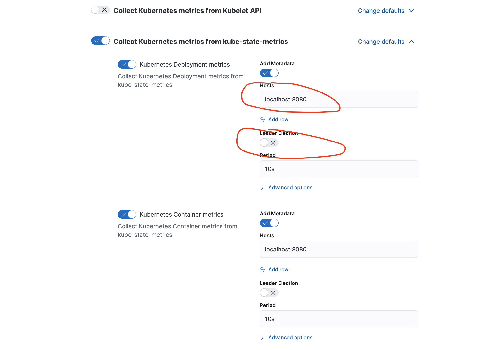
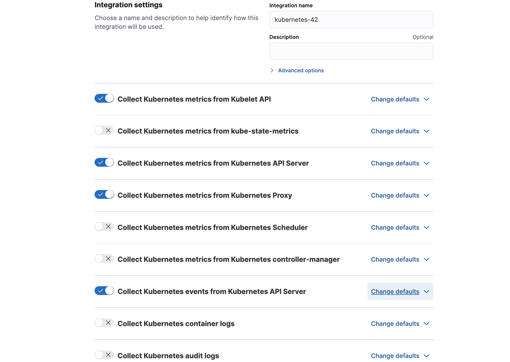

# Agent installed as side container with Kube State Metrics 

Follow below instructions to install Elastic Agent as side-container with Kube State Metrics Pods.

1. Download the kube-state-metrics:

```bash
git clone git@github.com:kubernetes/kube-state-metrics.git
```

2. Navigate to the directory of Autosharding example

```bash
cd kube-state-metrics/examples/autosharding
```

3. Download the [`./elastic-agent-kustomize`](./elastic-agent-kustomize) folder inside the above folder `kube-state-metrics/examples/autosharding`.

Your folder structure should look like the below:

```bash
ls -lrt
total 64
drwxr-xr-x 9    288 Jun  6 14:00 elastic-agent-kustomize
-rw-r--r-- 1    378 Jun  6 14:00 kustomization.yaml
-rw-r--r-- 1   7948 Jun  6 15:40 elastic-agent-managed-kubernetes.yaml
-rw-r--r-- 1   1957 Jun  6 15:59 README.md
```

4. Edit or replace the already existing `kube-state-metrics/examples/autosharding/kustomization.yaml` file with the example [kustomization.yaml](./kustomization.yaml)

The new `kustomization.yaml` should include:

```yaml
[outut truncated ...]
resources:
  - cluster-role-binding.yaml
  - cluster-role.yaml
  - role-binding.yaml
  - role.yaml
  - service-account.yaml
  - service.yaml
  - statefulset.yaml
  - ./elastic-agent-kustomize
replicas:
  - name: kube-state-metrics
    count: 2

patches:
- path: elastic-agent-kustomize/agent-statefulset.yaml
  target:
    kind: StatefulSet
```

5. Update the number of ReplicaSets in `kube-state-metrics/examples/autosharding/kustomization.yaml` and apply:

```bash
kubectl apply -k .
```

The `elastic-agent-kustomize/agent-statefulset.yaml` is the same as daemonset manifest except:
- `kind: StatefulSet`
- `hostNetwork: false`

The Statefulset points to a Fleet policy where only KSM is enabled with URL endpoint of `localhost:8080` and the leader election is disabled.



For node-wide metrics user needs to deploy the following policy:



Then deploy:

```bash
kubectl apply -f elastic-agent-managed-kubernetes.yaml
```

> (Update Enrollment details pointing to above policy)


## For Elastic Agent Standalone

Relevant manifests provided as examples:

- For Daemonset Leader: `kubectl apply -f elastic-agent-standalone-kubernetes-side-leader.yaml`
- For Statefulset: Update the agent-statefulset.yaml with `elastic-agent-standalone-statefulset-side-ksm.yaml` 