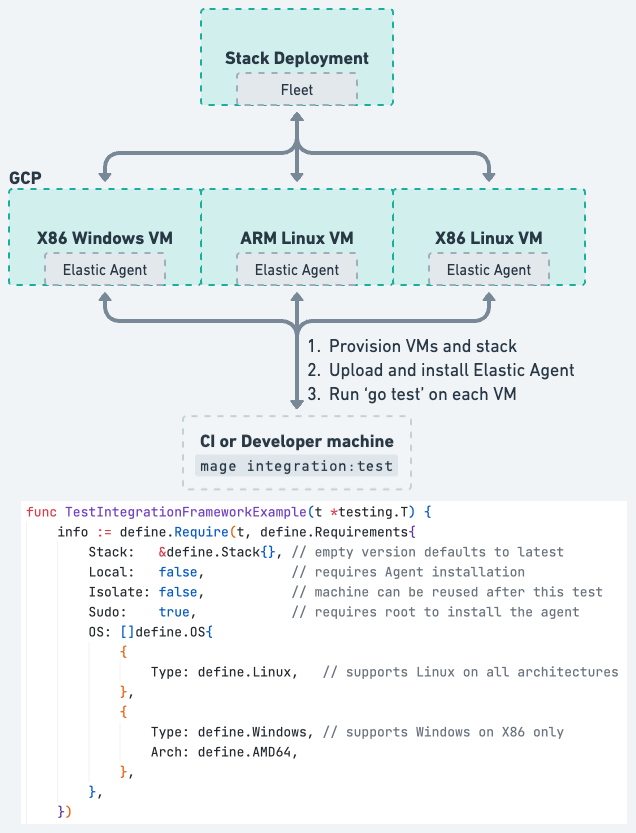

# Developer Guide for the Integration and E2E Testing Framework

The agent testing framework allows running integration and end-to-end tests against real agents
installed on remotely provisioned virtual machines. The current set of integration tests can be
found in https://github.com/elastic/elastic-agent/tree/main/testing/integration. Each test must
start with a `define.Require` declaration describing how the test can be run. The diagram below
provides a high level overview of the testing framework.

<center></center>

## Prerequisites

### Dependencies

#### Go version
Go version should be at least the same than the one in [.go-version](https://github.com/elastic/elastic-agent/blob/main/.go-version) file at the root of this repository.


### GCloud CLI
The integration testing framework spins up resources in GCP.  To acheive this, it needs the
[GCloud CLI](https://cloud.google.com/sdk/gcloud) to be installed on the system where the tests are initiated from.

### Beats
The Elastic Agent package that is used for integration tests packages Beats built from the Unified Release (as opposed to DRA).  There is no explicit action needed for this prerequisite but just keep in mind that if any Agent integration tests rely on certain Beats features or bugfixes, they may not be available in the integration tests yet because a unified release containing those features or bugfixes may not have happened yet.

### Configuration

ESS (staging) API Key to create on https://staging.found.no/account/keys

Warning: if you never created a deployment on it, you won't have permission to get this key, so you will need to create one first.

## Running tests

Some integration and E2E tests are safe to run locally. These tests set
`Local: true` in their test functions' `define.Require` directive. Tests that
don't set `Local: true` or explicitly set `Local: false` are not considered
safe to run locally and will be executed on remote VMs instead.

The framework will look for the agent version defined by the `AGENT_VERSION`
environment variable, even for local tests, **regardless of what was defined in
the test Fixture**. If `AGENT_VERSION` isn't set, it'll default to the current
version without SNAPSHOT.

### Setup
One-time setup is required to run any integration and E2E tests. Run
`mage integration:auth` to perform this setup.

You'll also need to separately authenticate to [Elastic's docker registry][elastic_docker_registry].
Go to https://docker-auth.elastic.co/ and authenticate with Okta to receive your credentials.

[elastic_docker_registry]: docker.elastic.co

### Running the tests

The test are run with mage using the `integration` namespace:

- `mage integration:test` to execute all tests under the `testing/integration`
  folder. All tests are executed on remote VMs, including those that set `Local: true`.

- `mage integration:local [testName|all]` to execute only those tests under the
  `testing/integration` folder that set `Local: true`. It'll run all the tests if
  `all` is passed as argument, or it'll pass `[testName]` to `go test` as
  `--run=[testName]`. These tests are executed on your local machine.

- `mage integration:single [testName]` to execute a single test under the `testing/integration` folder. Only the selected test will be executed on remote VMs.

- `mage integration:matrix` to run all tests on the complete matrix of supported operating systems and architectures of the Elastic Agent.

- `mage integration:kubernetes` to run kubernetes tests for the default image on the default version of kubernetes (all previous commands will not run any kubernetes tests).

- `mage integration:kubernetesMatrix` to run a matrix of kubernetes tests for all image types and supported versions of kubernetes.

#### Selecting specific platform

By default, the runner will deploy to every combination of operating system and architecture that the tests define
as supporting. When working on tests and debugging an issue it's better to limit the operating system and architecture
to a specific one. This can be done inside a test but requires the test code to be modified. An easier way is available
using the `TEST_PLATFORMS="linux/amd64"` environment variable. This variable can take multiple definitions with a space
between, and it can be very specific or not very specific.

- `TEST_PLATFORMS="linux" mage integration:test` to execute tests only on Linux using both AMD64 and ARM64.
- `TEST_PLATFORMS="linux/amd64" mage integration:test` to execute tests only on Linux AMD64.
- `TEST_PLATFORMS="linux/arm64/ubuntu mage integration:test` to execute tests only on Ubuntu ARM64.
- `TEST_PLATFORMS="linux/amd64/ubuntu/20.04 mage integration:test` to execute tests only on Ubuntu 20.04 ARM64.
- `TEST_PLATFORMS="windows/amd64/2022 mage integration:test` to execute tests only on Windows Server 2022.
- `TEST_PLATFORMS="linux/amd64 windows/amd64/2022 mage integration:test` to execute tests on Linux AMD64 and Windows Server 2022.
- `TEST_PLATFORMS="kubernetes/arm64/1.31.0/wolfi" mage integration:kubernetes` to execute kubernetes tests on Kubernetes version 1.31.0 with wolfi docker variant.

> **_NOTE:_**  This only filters down the tests based on the platform. It will not execute a tests on a platform unless
> the test defines as supporting it.

#### Selecting specific group

By default, the runner will run all test groups. Each group runs on a dedicated machine instance. When working on groups of tests it's better to limit to a specific
group of tests instead of running all tests. This can be done by using the `TEST_GROUPS="default upgrade-standalone"`
environment variable. This variable can take multiple groups with a space between.

- `TEST_GROUPS="default" mage integration:test` to execute only tests in the "default" group.
- `TEST_GROUPS="default upgrade-standalone" mage integration:test` to execute only tests in the "default" or
"upgrade-standalone" group.

#### Passing additional go test flags

When running the tests we can pass additional go test flag using the env variable `GOTEST_FLAGS`.

These flags are passed also when calculating batches for remote execution of integration tests.
This allows for selecting a subset of test in a convenient way (see examples below)

This feature is intended mostly for integration tests debugging/development without the need for
new mage targets corresponding to a new set of test flags.

A few examples:

##### Run a single test with an exact match
We want to run only the test named "TestStandaloneUpgrade"
`GOTEST_FLAGS="-test.run ^TestStandaloneUpgrade$" mage integration:test`

##### Run a tests matching a partial expression
We want to run any test with "Upgrade" in the name
`GOTEST_FLAGS="-test.run Upgrade" mage integration:test`

##### Run a single test and signal that we want the short version
We pass a `-test.short` flag along with the name match
`GOTEST_FLAGS="-test.run ^TestStandaloneUpgrade$ -test.short" mage integration:test`

##### Run a single test multiple times
We pass a `-test.count` flag along with the name match
`GOTEST_FLAGS="-test.run ^TestStandaloneUpgrade$ -test.count 10" mage integration:test`

##### Run specific tests
We pass a `-test.run` flag along with the names of the tests we want to run in OR
`GOTEST_FLAGS="-test.run ^(TestStandaloneUpgrade|TestFleetManagedUpgrade)$" mage integration:test`

##### Run Extended Runtime Leak Test
The test framework includes a "long running" test to check for resource leaks and stability.
The runtime of the test can be set via the `LONG_TEST_RUNTIME` environment variable.
The test itself can be run via the `integration:TestLongRunningAgentForLeaks` mage target.

##### Limitations
Due to the way the parameters are passed to `devtools.GoTest` the value of the environment variable
is split on space, so not all combination of flags and their values may be correctly split.

### Cleaning up resources

The test run will keep provisioned resources (instances and stacks) around after the tests have been ran. This allows
following `mage integration:*` commands to re-use the already provisioned resources.

- `mage integration:clean` will de-provision the allocated resources and cleanup any local state.

Tests with external dependencies might need more environment variables to be set
when running them manually, such as `ELASTICSEARCH_HOST`, `ELASTICSEARCH_USERNAME`,
`ELASTICSEARCH_PASSWORD`, `KIBANA_HOST`, `KIBANA_USERNAME`, and `KIBANA_PASSWORD`.

### Debugging tests

#### Connecting to VMs
All VMs (including Windows) support connections via SSH, the framework
generates and stores the necessary SSH keys to access the VMs, the
easiest way to connect to them is using the SSH command returned by
`mage integration:SSH`. It will list the VMs and ask to select
one.

On a Unix shell you can run `$(mage integration:SSH)`, the menu is
printed to stderr and the SSH command to stdout. After selecting the
VM you will have shell connected to it.

#### Credentials for cloud stack/projects
All cloud deployments and projects can be listed with `mage
integration:listStacks`, they can be used to manually connect to
Kibana and Elasticsearch.

If you need to manually run tests against any deployments, `mage
integration:GenerateEnvFile` will generate a file called `env.sh` that
exports environment variables for Unix compatible shells, you can load
them into your shell by running `source ./env.sh`.

To easily deploy the credentials to any VM, just run `mage
integration:DeployEnvFile`. A menu will ask for the desired Stack and
VM.

#### Manually running the tests (using `go test`)
If you want to run the tests manually, skipping the test runner, set the
`TEST_DEFINE_PREFIX` environment variable to any value and run your tests normally
with `go test`. E.g.:

```shell
TEST_DEFINE_PREFIX=gambiarra go test -v -tags integration -run TestProxyURL ./testing/integration/
```

You will need the environment variables containing the stack URL and
credentials for the tests to succeed.

#### Installing debug/build tools
`mage integration:DeployDebugTools` will install a few tools necessary
 to build the Elastic-Agent in the VM and debug tests:
 - Docker
 - Delve
 - Mage

When called, it will show a menu to select a VM and then install the
tools listed above. It will also create the `~/elastic-agent` folder
containing the Git repository (required o package from within the VM)
and the last version of the code uploaded to the VM. This allows you
to easily build/package the Elastic-Agent from within the VM as well
as run any tests.

In the VM there are two important folders:
- `agent`: that is created by the integration test framework and used
  by `mage` to run the tests, it gets updated every time you run an
  integration test from your machine.
- `elastic-agen`: that is a copy `agent` with Git information created
  by `mage integration:DeployDebugTools`, the Git information there is
  not a copy from your machine, but it will work if you need to
  package the Elastic-Agent from the VM. Most of the time you won't
  need it.

**Step-by-Step commands**

```shell
## Install DebugTools
mage -v integration:DeployDebugTools

## Generate and deploy env file
mage -v integration:DeployEnvFile

## SSH into the VM
$(mage integration:SSH)

## From inside the VM, the test needs root
sudo su
source ./env.sh
cd agent # That's the folder the mage automation uses to run the tests

## Then run the test using `go test`

TEST_DEFINE_PREFIX=gambiarra AGENT_VERSION="8.16.0-SNAPSHOT" go test -tags=integration -v ./testing/integration/ -run TestLogIngestionFleetManaged

## Run the test using delve:
## Any flags passed to the test binary go after the '--', they also need to
## include the `test.` prefix if they're for `go test`
TEST_DEFINE_PREFIX=gambiarra dlv test ./testing/integration/ --build-flags="-tags integration" -- -test.v -test.run TestLogIngestionFleetManaged
```

**A Delve trick:**
If you didn't build the Elastic-Agent directly on the machine you're
debugging, it is very likely the location of the source code is
different, hence delve cannot show you the code it is running. To
solve this, once on Delve shell, run:
``
config substitute-path /go/src/github.com/elastic/elastic-agent /home/ubuntu/agent
``
where:
- `/go/src/github.com/elastic/elastic-agent` is the path annotated in
  the binary you are debugging (the one Delve shows).
- `/home/ubuntu/agent` is where Delve should read the source
  code form.

#### Other useful mage targets:
- `integration:stacks` lists all stack deployments and connection
  information in a human readable table.
- `integration:listInstances` lists all VMs and their connection
  command in a human readable table. It also lists the URL for the
  VM page on GCP, which is helpful to verify if the VM still exists
  (OGC VMs are automatically deleted)
- `integration:printState` is a shortcut for running the two commands
  above.

#### Auto diagnostics retrieval
When an integration test fails the testing fixture will try its best to automatically collect the diagnostic
information of the installed Elastic Agent. In the case that diagnostics is collected the test runner will
automatically transfer any collected diagnostics from the instance back to the running host. The results of the
diagnostic collection are placed in `build/diagnostics`.

#### Gather diagnostics manually
In the case that you want to run the integration testing suite and have it gather the diagnostics at the end of
every tests you can use the environment variable `AGENT_COLLECT_DIAG=true`. When that environment variable is defined
it will cause the testing fixture to always collect diagnostics before the uninstall in the cleanup step of a test.

#### Keeping Elastic Agent installed

When the testing fixture installs the Elastic Agent, it will automatically uninstall
the Elastic Agent during the cleanup process of the test. In the event that you do
not want this to occur, you can disable the auto-uninstallation using the
AGENT_KEEP_INSTALLED=true environment variable. If the test succeeds, the agent
will be uninstalled regardless of the value of AGENT_KEEP_INSTALLED.

- `AGENT_KEEP_INSTALLED=true mage integration:single [testName]`

#### Run until failure
In the case that you're tracking down a flaky test it is helpful to have it keep running until it fails. The testing
suite has this ability built into it. Using the `TEST_RUN_UNTIL_FAILURE=true` will keep running the testing suite
until it reports a failure.

- `TEST_RUN_UNTIL_FAILURE=true mage integration:single [testName]`

## Writing tests

Write integration and E2E tests by adding them to the `testing/integration`
folder.

// TODO: Replace with a comprehensive write-up of `define.*` directives,
// environment variables, etc. useful when writing tests. Until then...

Look at existing tests under the `testing/integration` for examples of how
to write tests using the integration and E2E testing framework. Also look at
the `github.com/elastic/elastic-agent/pkg/testing/define` package for the test
framework's API and the `github.com/elastic/elastic-agent/pkg/testing/tools`
package for helper utilities.

### Test group

Every `define.Require` must define a `Group` that it belongs too. Each group is executed on a separate instance with all tests with in the same group executed
on the same instance. Placing similar tests in the same group allows those tests to run on its own instance
as well as provides a way for a developer to select a specific group of tests with `TEST_GROUP="{group-name}"`.

Grouping tests is another way of spreading out the testing load across multiple instances. The more groups that
are defined the more instances will be provisioned to complete all tests. A balance between a small good set of
groups is better than a ton of groups each executing a small set of tests, as the time to set up an instance can
out weight the benefits of creating another group.

### Test namespaces

Every test has access to its own unique namespace (a string value). This namespace can
be accessed from the `info.Namespace` field, where `info` is the struct value returned
from the `define.Require(...)` call made at the start of the test.

Namespaces should be used whenever test data is being written to or read from a persistent store that's
shared across all tests. Most commonly, this store will be the Elasticsearch cluster that Agent
components may index their data into. All tests share a single stack deployment and, therefore,
a single Elasticsearch cluster as well.

Some examples of where namespaces should be used:
* When creating a policy in Fleet. The Create Policy and Update Policy APIs takes a namespace parameter.
* When searching for documents in `logs-*` or `metrics-*` data streams. Every document in these
  data streams has a `data_stream.namespace` field.

:warning: Not using namespaces when accessing data in a shared persistent store can cause tests to
be flaky.

## Alternative Providers

### Multipass Instance Provisioner
By default the integration testing suite uses OGC with GKE to provision instances. In the case that you
want to use a local VM instead of a remote VM, you can use the [Multipass](https://multipass.run/) provisioner.

- `INSTANCE_PROVISIONER="multipass" mage integration:test`

It is always best to run `mage integration:clean` before changing the provisioner because the change will
not cause already provisioned resources to be replaced with an instance created by a different provisioner.

### Kind Instance Provisioner
Use only when running Kubernetes tests. Uses local installed kind to create Kubernetes clusters on the fly.

- `INSTANCE_PROVISIONER="kind" mage integration:kubernetes`

## Troubleshooting Tips

### Error: GCE service token missing; run 'mage integration:auth'
If you encounter this error when running `mage integration:test`, it's because
the test runner is unable to create VMs on GCP to execute the tests.

As the error message suggests, run `mage integration:auth` to resolve this error.

### Error: missing required Elastic Agent package builds for integration runner to execute: ...
If you encounter this error when running `mage integration:test` or
`mage integration:local`, it's because the test runner couldn't find the appropriate
Agent packages in the `build/distributions` folder.

Run `mage package` with the appropriate value(s) in `PLATFORMS`, as suggested by the
error message, to build the necessary Agent packages first.

If the issue is that the built Agent packages contain `-SNAPSHOT` in their versions,
whereas the package names in the error message do not, either omit `SNAPSHOT=true` from
the `mage package` command OR set the `AGENT_VERSION` environment variable to a version
that includes the `-SNAPSHOT` suffix when running `mage integration:test` or
`mage integration:local`.

### Failures on reused resources
The integration framework tries to re-use resource when it can. This improves the speed at
which the tests can run, but also means its possible for a failed test to leave state behind
that can break future runs.

Run `mage integration:clean` before running `mage integration:test` to ensure the tests are
being run with fresh instances and stack.

### OGC-related errors
If you encounter any errors mentioning `ogc`, try running `mage integration:clean` and then
re-running whatever `mage integration:*` target you were trying to run originally when you
encountered the error.

### Using a different agent version from the stack version

The agent version is used as a fallback for the stack version to use in integration tests
if no other version is specified.

If we need to use a different version between agent and stack we can specify the stack version
using a separate env variable `AGENT_STACK_VERSION` like in this example (we used a
custom package version for the agent):

```AGENT_VERSION="8.10.0-testpkgversion.1-SNAPSHOT" AGENT_STACK_VERSION="8.10.0-SNAPSHOT" mage integration:test```
