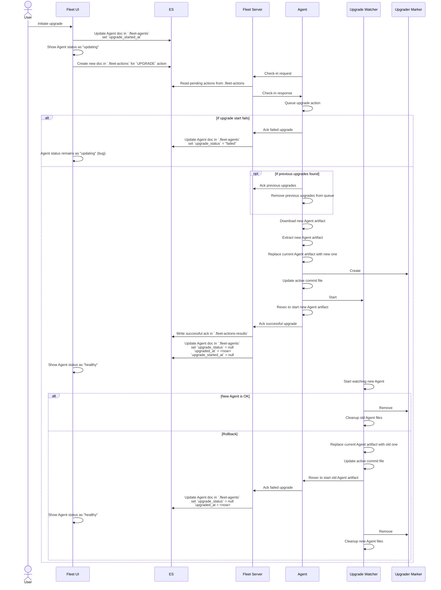

## Agent Upgrades

### Communications amongst components
The following sequence diagram illustrates the process of upgrading a
Fleet-managed Agent. The diagram focusses on the communications that occur
amongst the various components involved in the upgrade process.

This diagram is accurate as of version `8.9.0` of every component shown.

