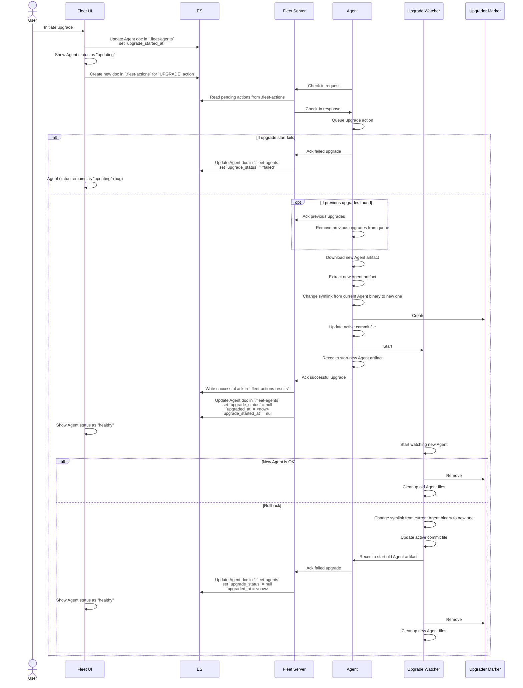

## Agent Upgrades

### Communications amongst components
The following sequence diagram illustrates the process of upgrading a
Fleet-managed Agent. The diagram focusses on the communications that occur
amongst the various components involved in the upgrade process.

This diagram is accurate as of version `8.9.0` of every component shown.



### Introducing package manifest

Starting from version 8.13.0 an additional file `manifest.yaml` is present in elastic-agent packages.
The purpose of this file is to present some metadata and package information to be used during install/upgrade operations.

The first enhancement that makes use of this package manifest is [#2579](https://github.com/elastic/elastic-agent/issues/2579)
as we use the manifest to map the package directory structure (based on agent commit hash) into one that takes also the
agent version into account. This allows releasing versions of the agent package where only the component versions change,
with the agent commit unchanged.


The [structure](../pkg/api/v1/manifest.go) of such manifest is defined in the [api/v1 package](../pkg/api/v1/).
The manifest data is generated during packaging and the file is added to the package files. This is an example of a
complete manifest:

```yaml
version: co.elastic.agent/v1
kind: PackageManifest
package:
  version: 8.13.0
  snapshot: true
  hash: 15658b38b48ba4487afadc5563b1576b85ce0264
  versioned-home: data/elastic-agent-15658b
  path-mappings:
    - data/elastic-agent-15658b: data/elastic-agent-8.13.0-SNAPSHOT-15658b
      manifest.yaml: data/elastic-agent-8.13.0-SNAPSHOT-15658b/manifest.yaml
```

The package information describes the package version, whether it's a snapshot build, the elastic-agent commit hash it
has been built from and where to find the versioned home of the elastic agent within the package.

Another section lists the path mappings that must be applied by an elastic-agent that is aware of the package manifest
(version >8.13.0): these path mappings allow the incoming agent version to have some control over where the files in
package will be stored on disk.

#### Upgrading without the manifest

Legacy elastic-agent upgrade is a pretty straightforward affair:
- Download the agent package to use for upgrade
- Open the .zip or .tar.gz archive and iterate over the files
  - Look for the elastic-agent commit file to retrieve the actual hash of the agent version we want to install
  - Extract any package file under `/data` under the installed agent `/data` directory
- After extraction check if the hash we read from the package matches with the one from the current agent:
  - if it's the same hash the upgrade fails because we are trying to upgrade to the same version
  - if we extracted a package with a different hash, the upgrade keeps going
- Copy the elastic agent action store and components run directory into the new agent directories `elastic-agent-<hash>`
- Rotate the symlink in the top directory to point to the new agent executable `data/elastic-agent-<hash>/elastic-agent`
- Write the update marker containing the information about the new and old agent versions/hashes in `data` directory
- Invoke the watcher `elastic-agent watch` command to ensure that the new version of agent works correctly after restart
- Shutdown current agent and its command components, copy components state once again and restart

#### Upgrading using the manifest

Upgrading using the manifest allows for the new version to pass along some information about the package to the upgrading agent.
The new process looks like this:
- Download the elastic-agent package to use for upgrade
- Extract package metadata from the new elastic-agent package (`version`, `snapshot` and `hash`):
  - if the package has a manifest we extract `version` and `snapshot` flag as declared by the package manifest
  - if there is no manifest for the package we extract `version` and `snapshot` from the version string passed to the upgrader
  - the `hash` is always retrieved from the agent commit file (this is always present in the package)
- compare the tuple of new `(version, snapshot, hash)` to the current `(version, snapshot, hash)`: if they are the same
  the upgrade fails because we are trying to upgrade to the same version as current
- Extract any package file (after mapping it using file mappings in manifest if present) that should go under `/data`.
  Return the new versionedHome (where the new version of agent has its files, returned as path relative to the top directory)
- Copy the elastic agent action store and components run directory into the new agent in `<versionedHome>/run`
- Write the update marker containing the information about the new and old agent version, hash and home in `data` directory
- Invoke the watcher `elastic-agent watch` command to ensure that the new version of agent works correctly after restart:
  - we invoke the current agent binary if the new version < 8.13.0 (needed to make sure it supports the paths written in the update marker)
  - we invoke the new agent binary if the new version > 8.13.0
- Shutdown current agent and its command components, copy components state once again and restart
