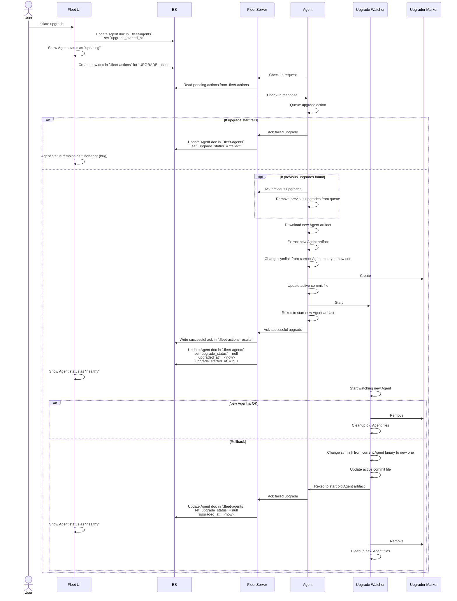

## Agent Upgrades

### Communications amongst components
The following sequence diagram illustrates the process of upgrading a
Fleet-managed Agent. The diagram focusses on the communications that occur
amongst the various components involved in the upgrade process.

This diagram is accurate as of version `8.9.0` of every component shown.



### Introducing package manifest

Starting from version 8.13.0 an additional file `manifest.yaml` is present in elastic-agent packages.
The purpose of this file is to present some metadata and package information to be used during install/upgrade operations.

The [structure](../pkg/api/v1/manifest.go) of such manifest is defined in the [api/v1 package](../pkg/api/v1/).
The manifest data is generated during packaging and the file is added to the package files. This is an example of a
complete manifest:

```yaml
version: co.elastic.agent/v1
kind: PackageManifest
package:
  version: 8.13.0
  snapshot: true
  hash: 15658b38b48ba4487afadc5563b1576b85ce0264
  versioned-home: data/elastic-agent-15658b
  path-mappings:
    - data/elastic-agent-15658b: data/elastic-agent-8.13.0-SNAPSHOT-15658b
      manifest.yaml: data/elastic-agent-8.13.0-SNAPSHOT-15658b/manifest.yaml
```

The package information describes the package version, whether it's a snapshot build, the elastic-agent commit hash it
has been built from and where to find the versioned home of the elastic agent within the package.

Another section lists the path mappings that must be applied by an elastic-agent that is aware of the package manifest
(version >8.13.0): these path mappings allow the incoming agent version to have some control over where the files in
package will be stored on disk.
