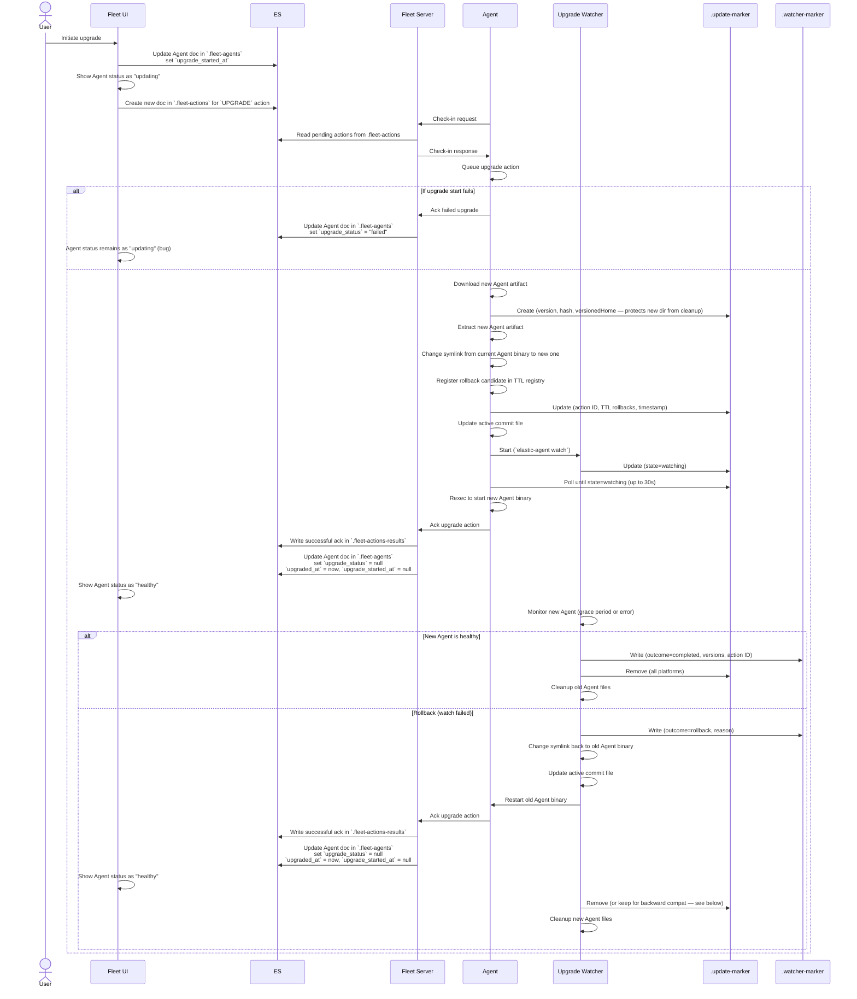

## Agent Upgrades

### Communications amongst components
The following sequence diagram illustrates the process of upgrading a
Fleet-managed Agent. The diagram focuses on the communications that occur
amongst the various components involved in the upgrade process.


```mermaid
sequenceDiagram
    actor U as User
    participant UI as Fleet UI
    participant ES
    participant FS as Fleet Server
    participant A as Agent
    participant UW as Upgrade Watcher
    participant UM as .update-marker
    participant WM as .watcher-marker

    U->>UI: Initiate upgrade
    UI->>ES: Update Agent doc in `.fleet-agents`<br />set `upgrade_started_at`
    UI->>UI: Show Agent status as "updating"
    UI->>ES: Create new doc in `.fleet-actions` for `UPGRADE` action
    A->>FS: Check-in request
    FS->>ES: Read pending actions from .fleet-actions
    FS->>A: Check-in response
    A->>A: Queue upgrade action
    alt If upgrade start fails
       A->>FS: Ack failed upgrade
       FS->>ES: Update Agent doc in `.fleet-agents`<br />set `upgrade_status` = "failed"
       UI->>UI: Agent status remains as "updating" (bug)
    else
       A->>A: Download new Agent artifact
       A->>UM: Create (version, hash, versionedHome — protects new dir from cleanup)
       A->>A: Extract new Agent artifact
       A->>A: Change symlink from current Agent binary to new one
       A->>A: Register rollback candidate in TTL registry
       A->>UM: Update (action ID, TTL rollbacks, timestamp)
       A->>A: Update active commit file
       A->>UW: Start (`elastic-agent watch`)
       UW->>UM: Update (state=watching)
       A->>UM: Poll until state=watching (up to 30s)
       A->>A: Rexec to start new Agent binary
       A->>FS: Ack upgrade action
       FS->>ES: Write successful ack in `.fleet-actions-results`
       FS->>ES: Update Agent doc in `.fleet-agents`<br />set `upgrade_status` = null<br />`upgraded_at` = now, `upgrade_started_at` = null
       UI->>UI: Show Agent status as "healthy"
       UW->>UW: Monitor new Agent (grace period or error)
       alt New Agent is healthy
         UW->>WM: Write (outcome=completed, versions, action ID)
         UW->>UM: Remove (all platforms)
         UW->>UW: Cleanup old Agent files
       else Rollback (watch failed)
         UW->>WM: Write (outcome=rollback, reason)
         UW->>UW: Change symlink back to old Agent binary
         UW->>UW: Update active commit file
         UW->>A: Restart old Agent binary
         A->>FS: Ack upgrade action
         FS->>ES: Write successful ack in `.fleet-actions-results`
         FS->>ES: Update Agent doc in `.fleet-agents`<br />set `upgrade_status` = null<br />`upgraded_at` = now, `upgrade_started_at` = null
         UI->>UI: Show Agent status as "healthy"
         UW->>UM: Remove (or keep for backward compat — see below)
         UW->>UW: Cleanup new Agent files
       end
    end
```

### Marker file architecture

The upgrade process uses two persistent files to track state. The split
separates the upgrade marker (owned jointly by agent and watcher) from the
watcher outcome record (watcher-only write, coordinator read-only).

| File | Written by | Read by | Lifetime |
|------|-----------|---------|---------|
| `.update-marker` | Agent (create), Watcher (detail updates) | Coordinator, Watcher | Created at upgrade start; removed by Watcher on terminal outcome |
| `.watcher-marker` | Watcher only | Coordinator (read-only) | Never deleted; overwritten at the start of each upgrade cycle |

#### `.update-marker`

Created by the agent when an upgrade begins. Contains the target and previous
version/hash, the versioned home paths, the Fleet action ID, and the current
upgrade details (state + metadata). The watcher updates the details field
throughout the watch phase. Removed by the watcher on all platforms once a
terminal outcome is reached.

#### `.watcher-marker`

Written by the watcher immediately before removing the upgrade marker. Records
the terminal outcome (`completed`, `rollback`, or `failed`) along with version
tuple, action ID, reason or error message, and a completion timestamp.

The coordinator's file watcher fires on every upgrade marker change. While the
upgrade marker exists, `marker.Details` is authoritative for Fleet reporting.
When the marker is removed (nil details), the coordinator reads the watcher
marker and re-reports any non-completed terminal state so Fleet receives the
correct outcome even if the agent was offline between the watcher writing the
file and the next check-in. On agent restart with no upgrade marker on disk,
the coordinator likewise reads the watcher marker on startup to re-report any
pending terminal state from the previous upgrade cycle.

A staleness guard prevents an old watcher marker from being mistaken for the
current upgrade cycle by matching version tuple, completion timestamp, and action ID.

#### Backward compatibility

When rolling back to an older agent that reads the upgrade marker on startup to
detect rollback, the upgrade marker is **kept on disk** after rollback. Those
agents have no knowledge of the watcher marker.

When rolling back to a recent agent, the upgrade marker is removed during
rollback; the rolled-back agent relies on the watcher marker via the coordinator.

### Manual rollback

A manual rollback can be triggered by Fleet or the CLI after the upgrade grace
period has elapsed.

**When the upgrade marker is still present:** the upgrade marker is read to
identify the agent installs involved and select the watcher executable. The
existing watcher is gracefully stopped, rollback candidates are read from the
TTL rollback files on disk, and a rollback watcher is started.

**When the upgrade marker has already been removed** (the watcher finished its
cleanup): the rollback path creates a temporary upgrade marker to drive the
rollback watcher. Before starting the rollback watcher it checks whether a
previous watcher is still in its cleanup phase by attempting to acquire
`watcher.lock`. If the lock is held (lingering watcher), the rollback takes over
the lingering watcher first, then starts the rollback watcher normally.

### Introducing package manifest

Starting from version 8.13.0 an additional file `manifest.yaml` is present in elastic-agent packages.
The purpose of this file is to present some metadata and package information to be used during install/upgrade operations.

The first enhancement that makes use of this package manifest is [#2579](https://github.com/elastic/elastic-agent/issues/2579)
as we use the manifest to map the package directory structure (based on agent commit hash) into one that takes also the
agent version into account. This allows releasing versions of the agent package where only the component versions change,
with the agent commit unchanged.


The [structure](../pkg/api/v1/manifest.go) of such manifest is defined in the [api/v1 package](../pkg/api/v1/).
The manifest data is generated during packaging and the file is added to the package files. This is an example of a
complete manifest:

```yaml
version: co.elastic.agent/v1
kind: PackageManifest
package:
  version: 8.13.0
  snapshot: true
  hash: 15658b38b48ba4487afadc5563b1576b85ce0264
  versioned-home: data/elastic-agent-15658b
  path-mappings:
    - data/elastic-agent-15658b: data/elastic-agent-8.13.0-SNAPSHOT-15658b
      manifest.yaml: data/elastic-agent-8.13.0-SNAPSHOT-15658b/manifest.yaml
```

The package information describes the package version, whether it's a snapshot build, the elastic-agent commit hash it
has been built from and where to find the versioned home of the elastic agent within the package.

Another section lists the path mappings that must be applied by an elastic-agent that is aware of the package manifest
(version >8.13.0): these path mappings allow the incoming agent version to have some control over where the files in
package will be stored on disk.

#### Upgrading without the manifest

Legacy elastic-agent upgrade is a pretty straightforward affair:
- Download the agent package to use for upgrade
- Open the .zip or .tar.gz archive and iterate over the files
  - Look for the elastic-agent commit file to retrieve the actual hash of the agent version we want to install
  - Extract any package file under `/data` under the installed agent `/data` directory
- After extraction check if the hash we read from the package matches with the one from the current agent:
  - if it's the same hash the upgrade fails because we are trying to upgrade to the same version
  - if we extracted a package with a different hash, the upgrade keeps going
- Copy the elastic agent action store and components run directory into the new agent directories `elastic-agent-<hash>`
- Rotate the symlink in the top directory to point to the new agent executable `data/elastic-agent-<hash>/elastic-agent`
- Write the update marker containing the information about the new and old agent versions/hashes in `data` directory
- Invoke the watcher `elastic-agent watch` command to ensure that the new version of agent works correctly after restart
- Shutdown current agent and its command components, copy components state once again and restart

#### Upgrading using the manifest

Upgrading using the manifest allows for the new version to pass along some information about the package to the upgrading agent.
The new process looks like this:
- Download the elastic-agent package to use for upgrade
- Extract package metadata from the new elastic-agent package (`version`, `snapshot` and `hash`):
  - if the package has a manifest we extract `version` and `snapshot` flag as declared by the package manifest
  - if there is no manifest for the package we extract `version` and `snapshot` from the version string passed to the upgrader
  - the `hash` is always retrieved from the agent commit file (this is always present in the package)
- compare the tuple of new `(version, snapshot, hash)` to the current `(version, snapshot, hash)`: if they are the same
  the upgrade fails because we are trying to upgrade to the same version as current
- Extract any package file (after mapping it using file mappings in manifest if present) that should go under `/data`.
  Return the new versionedHome (where the new version of agent has its files, returned as path relative to the top directory)
- Copy the elastic agent action store and components run directory into the new agent in `<versionedHome>/run`
- Write the update marker containing the information about the new and old agent version, hash and home in `data` directory
- Invoke the watcher `elastic-agent watch` command to ensure that the new version of agent works correctly after restart:
  - we invoke the current agent binary if the new version < 8.13.0 (needed to make sure it supports the paths written in the update marker)
  - we invoke the new agent binary if the new version > 8.13.0
- Shutdown current agent and its command components, copy components state once again and restart

### Windows Add/Remove Programs registry entry

Starting from version 9.4.0, Elastic Agent creates an entry in the Windows
`HKLM\SOFTWARE\Microsoft\Windows\CurrentVersion\Uninstall` registry key during
installation. This makes the agent visible in the Windows "Add or Remove
Programs" list with metadata such as version, publisher, install date, and
uninstall command.

#### How the version is kept in sync

The registry entry's `DisplayVersion` is updated by the **new agent** on startup
when an upgrade marker is present. On rollback, the old agent restarts with the
marker still present and reverts `DisplayVersion` to its own version.

For **privileged** installs the agent runs as `LocalSystem` and can always
write to the registry.

For **unprivileged** installs the registry key's ACL is configured during
installation to grant the `elastic-agent-user` write access. This allows the
unprivileged agent to update `DisplayVersion` after an upgrade.

#### Upgrading from a version before 9.4.0 (unprivileged)

When upgrading from a version that did not create the registry entry, the
new agent will not have permission to create the key because the ACL was never
set.

To create the entry and set the correct ACL after upgrading, run:

```
elastic-agent windows registry update
```

This creates the registry key, writes the current version and configures the
ACL so future unprivileged upgrades can update it automatically.

#### Uninstall

The registry entry is removed during `elastic-agent uninstall` as part of the
platform-specific post-uninstall cleanup.
