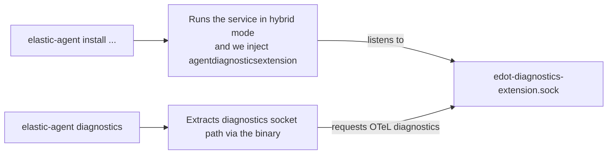

# elasticdiagnosticsextension

`elasticdiagnosticsextension` is an internal package for peforming diagnostics and is used in conjunction with EDOT.
The extension is designed to return diagnostics in a format compatible with the [ActionDiagnosticUnitResult](https://github.com/elastic/elastic-agent-client/blob/888026ef85e1c9190fe76eb158cf21d9c9c02920/elastic-agent-client.proto#L424-L437) type defined in the control protocol.

## Configuration

The extension accepts the `endpoint` as a sole parameter. The endpoint should begin with a valid protocol and it valid values are `unix` and `npipe` for now. Here are a few examples:

- `unix:///tmp/elastic-agent/xyz.soc`
- `npipe:///elastic-agent`

## Features

- Acts as a registrar and keeps track of common diagnostic hooks.
- Collects profiles using `runtime/pprof`.
- Collects internal telemetry exposed by the OTeL Collector.
- Implements the `extensioncapabilities.ConfigWatcher` interface and stores the latest configuration of the running collector.
- Listens for diagnostic requests and provides diagnostic data. 

## Design

### Diagnostic hooks:
- Individual beats register custom diagnostic hooks and these hooks are called when we run the elastic-agent diagnostics command.
- Our extension stores these hooks and executes them everytime it gets a "diagnostics" request.

### Request/Response format:
- This extension runs an HTTP server and listens to new requests on `/diagnostics` path.
- The following query parameters are optional:
    - `cpu`
        - If `true`, the extension will also collect cpu profile of EDOT. 
        - By default, the extension doesn't collect the CPU profile unless explicitly specified.
    - `cpuduration`:
        - Specifies the time duration over which the CPU profile should be collected.
        - Valid time units are `ns`, `us`, `ms`, `s`, `m`, `h`
        - Default: `30s`.
- The response format is defined in [response.go](./response.go). 
    - `GlobalDiagnostics`: Data related to the overall process:
        1. Profiles.
        2. Internal telemetry.
        3. latest collector configuration.
    - `ComponentDiagnostics`: Data from individual receivers, collected via registered diagnostic hooks.

### Interaction with Elastic-Agent service in hybrid mode.

- When the user triggers the diagnostic request, EDOT diagnostics are injected at two levels:
    1. At top-Level:
        - When `DiagnosticAgent()` is called in [server.go](https://github.com/elastic/elastic-agent/blob/710c49f45433e2f136a6e41cae980c1aa37dabdd/pkg/control/v2/server/server.go#L197).
        - Diagnostics are captured at the global level and stored under the `edot/*` directory in the resulting ZIP archive.
    2. At component-level:
        - When `otelMgr.PerformComponentsDiagnostics()` is called in [coordinator.go](https://github.com/elastic/elastic-agent/blob/710c49f45433e2f136a6e41cae980c1aa37dabdd/internal/pkg/agent/application/coordinator/coordinator.go#L863).
        - Diagnostics are added per component and stored under the `components/{comp}/*` directory in the resulting ZIP archive.

#### Diagram

