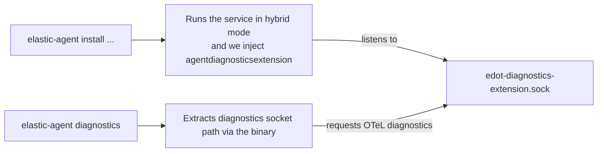

# elasticdiagnosticsextension

`elasticdiagnosticsextension` is an internal package for peforming diagnostics and is used in conjunction with EDOT.
The extension is designed to return diagnostics in a format compatible with the [ActionDiagnosticUnitResult](https://github.com/elastic/elastic-agent-client/blob/888026ef85e1c9190fe76eb158cf21d9c9c02920/elastic-agent-client.proto#L424-L437) type defined in the control protocol.

The extension also routes Fleet actions (for example osquery live queries) to the specific beat receiver instance they target, since beat receivers running inside the collector have no direct gRPC control connection to elastic-agent.

## Configuration

The extension accepts the `endpoint` as a sole parameter. The endpoint should begin with a valid protocol and it valid values are `unix` and `npipe` for now. Here are a few examples:

- `unix:///tmp/elastic-agent/xyz.soc`
- `npipe:///elastic-agent`

## Features

- Acts as a registrar and keeps track of common diagnostic hooks.
- Collects profiles using `runtime/pprof`.
- Collects internal telemetry exposed by the OTeL Collector.
- Implements the `extensioncapabilities.ConfigWatcher` interface and stores the latest configuration of the running collector.
- Listens for diagnostic requests and provides diagnostic data.
- Routes Fleet actions to the beat receiver instance they target and returns the result.

## Design

### Diagnostic hooks:
- Individual beats register custom diagnostic hooks and these hooks are called when we run the elastic-agent diagnostics command.
- Our extension stores these hooks and executes them everytime it gets a "diagnostics" request.

### Request/Response format:
- This extension runs an HTTP server and listens to new requests on `/diagnostics` path.
- The following query parameters are optional:
    - `cpu`
        - If `true`, the extension will also collect cpu profile of EDOT.
        - By default, the extension doesn't collect the CPU profile unless explicitly specified.
    - `cpuduration`:
        - Specifies the time duration over which the CPU profile should be collected.
        - Valid time units are `ns`, `us`, `ms`, `s`, `m`, `h`
        - Default: `30s`.
- The response format is defined in [response.go](./response.go).
    - `GlobalDiagnostics`: Data related to the overall process:
        1. Profiles.
        2. Internal telemetry.
        3. latest collector configuration.
    - `ComponentDiagnostics`: Data from individual receivers, collected via registered diagnostic hooks.

### Action hooks:
- Individual beats register an action handler (for example osquerybeat's live query handler) via `otelmanager.OtelManager.RegisterAction`, which forwards it to this extension keyed by the beat receiver's component ID.
- The extension exposes `POST /actions` for elastic-agent to invoke: the request body identifies the target elastic-agent component ID, the action name, and its parameters (see [response.go](./response.go) for `ActionRequest`/`ActionResponse`).
- The extension resolves the request's component ID against registered receiver names using the same `_agent-component/<comp.ID>/<streamID>` correlation used for diagnostics, invokes the matching handler, and returns its result (or error) as JSON.
- Action results themselves (for example osquery query rows) are published to Elasticsearch by the beat's normal publishing pipeline, not returned in the HTTP response — the response only carries ack/error status back to Fleet.
- elastic-agent's client for this route is `otel.PerformActionExt` in [../../actions.go](../../actions.go), used by `Coordinator.PerformAction` when a component's `RuntimeManager` is `otel`. If the collector is mid-restart (e.g. a config change reloaded it) when an action is dispatched, `PerformActionExt` retries the connection attempt with a bounded backoff rather than failing on the first try — but only while still establishing the connection; once a request has actually been sent, failures are returned immediately, since re-sending could double-execute a non-idempotent action.
- **Single-receiver requirement:** since [#13000](https://github.com/elastic/elastic-agent/pull/13000), a component's input normally runs as one OTel receiver *per stream*, each its own beat process. A Fleet action carries no per-stream targeting information, so a component whose beat registers a custom action must set `single_receiver: true` in its spec (as osquery's does) to guarantee exactly one receiver — and therefore exactly one registered handler — per component ID. If more than one receiver ever registers an action for the same component ID, this is surfaced twice: `RegisterActionHandler` itself returns an error, which `otelmanager.OtelManager.RegisterAction` logs from the conflicting beat's own process (visible immediately, at registration time); and separately `/actions` returns `409 Conflict` with an "ambiguous action routing" error rather than guessing which receiver to route to (a defense-in-depth check at action-processing time, independent of whether the registration-time error was logged/noticed).

### Interaction with Elastic-Agent service in hybrid mode.

- When the user triggers the diagnostic request, EDOT diagnostics are injected at two levels:
    1. At top-Level:
        - When `DiagnosticAgent()` is called in [server.go](https://github.com/elastic/elastic-agent/blob/710c49f45433e2f136a6e41cae980c1aa37dabdd/pkg/control/v2/server/server.go#L197).
        - Diagnostics are captured at the global level and stored under the `edot/*` directory in the resulting ZIP archive.
    2. At component-level:
        - When `otelMgr.PerformComponentsDiagnostics()` is called in [coordinator.go](https://github.com/elastic/elastic-agent/blob/710c49f45433e2f136a6e41cae980c1aa37dabdd/internal/pkg/agent/application/coordinator/coordinator.go#L863).
        - Diagnostics are added per component and stored under the `components/{comp}/*` directory in the resulting ZIP archive.

#### Diagram

```mermaid
graph LR
    A[elastic-agent install ...] --> B[Runs the service in hybrid mode<br/>and we inject agentdiagnosticsextension]
    B -->|listens to| D[edot-diagnostics-extension.sock]

    C[elastic-agent diagnostics] --> E[Extracts diagnostics socket path via the binary]
    E -->|requests OTeL diagnostics| D
```
